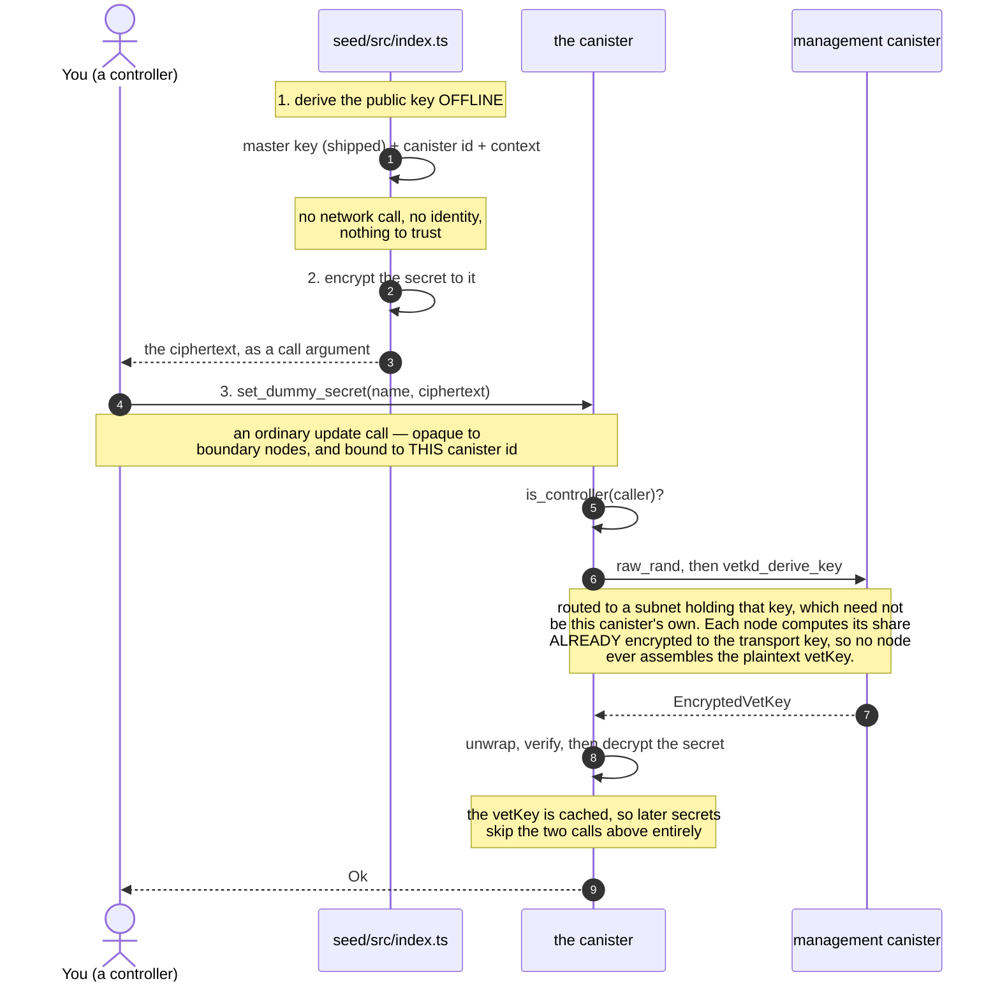

# Seeding a canister with secrets, via vetKeys

A minimal proof of concept: get secrets — an API key, a token, a private key,
anything — into a **deployed** canister without the plaintext ever appearing in
an ingress message, a manifest, a shell history, or a CI log.

The client encrypts to a public key it derives **offline**, sends the ciphertext
in an ordinary update call, and only the target canister can recover the
plaintext.

```bash
DUMMY_SECRET=super-secret-value ./scripts/seal.sh dummy-secret-rust exchange-rate-api-key
```

Two endpoints, two implementations of them, and one script. Everything on the
path is meant to be read start to finish:

| file                                                           | size      |
| -------------------------------------------------------------- | --------- |
| [`rust/canister/src/lib.rs`](./rust/canister/src/lib.rs)       | 209 lines |
| [`motoko/canister/src/Main.mo`](./motoko/canister/src/Main.mo) | 220 lines |
| [`seed/src/index.ts`](./seed/src/index.ts)                     | 164 lines |

> A fuller version of this — a proposed standard interface, subnet preflight
> checks, rotation, key-diffing, an HTTPS-outcall example, and the reasoning
> behind each — lives on the
> [`standardization-proposal`](../../tree/standardization-proposal) branch. This
> branch is deliberately the bare mechanism.

## Why this needs vetKD

You want to hand a secret to one specific canister so only it can read it. That
is what public-key encryption is for — the recipient needs a public key you can
encrypt to, and a private key only they can use.

**A canister cannot generate a keypair and keep the private half.** Its entire
memory is replicated to every node of its subnet, written to disk in
checkpoints, and shipped to new nodes during state sync. Its randomness is not
private either — `raw_rand` is derived from the round's random tape, a threshold
signature the subnet produces and every node holds. There is nowhere to put a
private key that the subnet cannot see.

**vetKD supplies the missing half.** Subnets that hold a vetKD key hold a master
secret, split across their nodes so no single node has it. From that:

- **anyone** can compute, offline, the _public_ key for a given (canister,
  context) pair — no network call, no permission;
- **only that canister** can have the matching private key reconstructed, by
  calling `vetkd_derive_key` on the management canister.

That is a real keypair for a canister, which is the thing that did not exist
before. The call is routed like any other chain-key request, to a subnet enabled
for that key — which need not be the calling canister's own. What binds the key
to _your_ canister is not which subnet serves it, but that the derivation takes
the **caller's** canister id as an input.

Note what this does and does not solve. The private key is still not hidden from
the subnet — it cannot be, for the reasons above. What changed is that a client
can now encrypt to a canister offline, and only that canister can obtain the
matching key. Trusting the subnet with the plaintext is the remaining
requirement, and
[why this design needs a confidential subnet](#why-this-design-needs-a-confidential-subnet)
is about exactly that.

## The flow



Two things worth noticing. The client derives the key **itself**, from a master
public key shipped in the vetKeys library — it never asks the canister what to
encrypt to, because anyone able to tamper with that reply could hand it a key
they control.

And **only the sending step involves you.** Encrypting is pure computation with
no key of yours in it, so anyone can seal a secret _to_ this canister — and only
the canister can open it. The call is what needs a signature, from a controller.

## What the canister actually receives

Not a key. An `EncryptedVetKey` — three curve points — which it unwraps itself.
Three things about that are not obvious from the call.

**The vetKey is a BLS signature**, and the rest follows from that. The derived
public key is an IBE _master_ public key, and the private key for a label is the
**signature over that label** under the matching secret. "Derive the key for this
label" and "sign this label" are the same operation.

**It arrives encrypted, and no node ever assembles it.** The canister sends a
single-use _transport public key_ with the request, and that key goes into the
share computation itself: each node produces a share **already encrypted under
it** (`create_encrypted_key_share`), and combining encrypted shares yields an
encrypted key (`combine_encrypted_key_shares`). At no point does any replica hold
the plaintext vetKey — not the ones that computed it, and not whatever subnet
served the request, which may not be this canister's own.

**The canister does decrypt it**, with the transport secret key it generated and
never sent. So the plaintext does exist, in the canister's memory — which is
replicated to every node of its subnet and checkpointed to disk like any other
canister state, and protected there by SEV-SNP and nothing else.

What the transport key buys, then, is not that the key is never in the clear
anywhere. It is that the plaintext never leaves the requesting canister's own
state: never in a message, never in a cross-subnet stream, never known to the
subnet that derived it.

**Unwrapping is also a verification**, and that is what stops a forged reply.
`decrypt_and_verify` does three things, in order:

1. rejects a reply whose two randomisers disagree, before unwrapping anything;
2. strips the transport blinding, which cancels exactly;
3. checks the result is a valid BLS signature over `KEY_LABEL` under `dpk`.

Step 3 is the one that matters. Without it the canister accepts whatever the
reply contained; with it, forging a reply means forging a BLS signature under a
key you do not have. The algebra is in
[`ic-vetkeys`](https://github.com/dfinity/vetkeys) — `EncryptedVetKey::decrypt_and_verify`.

Only then does it decrypt the secret, and that step is authenticated too: after
recovering the plaintext it recomputes the scalar the ciphertext commits to and
checks it matches, so a wrong key gives an error rather than plausible-looking
garbage.

## Storing more than one secret

Costs exactly one derivation, no matter how many. A canister holding secrets
usually holds several — credentials for the HTTPS outcalls it makes, say — and
every one of them is sealed to the same **label**: `KEY_LABEL`, the IBE identity.
One derived key opens every ciphertext sealed to it. The per-secret names are map keys in the canister's own
storage; they are not part of any derivation and never reach vetKD.

```text
caller  = your canister id      the replica fills this in; cannot be forged
context = "dummy-secret-poc"    your namespace
label   = "dummy-secrets"       one key, derived once and cached

   ├── secrets["exchange-rate-api-key"]   all sealed to that one key
   └── secrets["rpc-provider-key"]
```

Giving each secret its own label would cost a separate `vetkd_derive_key` — 26
billion cycles each — and buy nothing, because there is no privilege boundary
inside a canister to enforce: the code can derive any label's key whenever it
likes. Distinct labels earn their cost when the _recipients_ differ, as in a
per-user design where one user's key must not open another's data.

The key is cached after first use. Nothing at runtime can invalidate it:
derivation is deterministic in `(caller, context, label, key_id)`, none of which
depends on the secrets. Without the cache every write would pay a derivation and
a round through consensus for a key that never changes.

What _does_ invalidate it is editing `CONTEXT` or `KEY_LABEL`. The Rust cache is
heap and is discarded on upgrade, so it re-derives; the Motoko one persists, and
will keep serving the key for the old values until the canister is reinstalled.

## Try it

Needs [icp-cli](https://github.com/dfinity/icp-cli), a Rust toolchain with the
`wasm32-unknown-unknown` target, [mops](https://mops.one), and Node 18+.

```bash
./scripts/local-test.sh
```

That starts a local network, deploys both canisters, seals two secrets into
each, reads them back, and checks they match. To do it by hand:

```bash
icp network start local --background
icp deploy -e local --yes

DUMMY_SECRET=super-secret-value ./scripts/seal.sh dummy-secret-rust exchange-rate-api-key
DUMMY_SECRET=another-value      ./scripts/seal.sh dummy-secret-rust rpc-provider-key

icp canister call dummy-secret-rust get_dummy_secret '("exchange-rate-api-key")' -e local
# (variant { Ok = opt "super-secret-value" })
```

The second seal costs no derivation — the canister cached the key from the
first. `scripts/seal.sh` wraps two steps that are worth seeing apart, because only
one of them involves you:

```bash
CID=$(icp canister status dummy-secret-rust -e local -i)

# 1. encrypt — offline, and with no identity involved
DUMMY_SECRET=super-secret-value npm --prefix seed run seal -- \
  --canister "$CID" --name exchange-rate-api-key --out /tmp/arg.did

# 2. send it — an ordinary call, made by a controller of the canister
icp canister call dummy-secret-rust set_dummy_secret --args-file /tmp/arg.did -e local
```

For the Motoko canister, pass `dummy-secret-motoko` and read it back with
`getDummySecret` — each implementation names its methods the way its own
language does, and the wrapper picks the right one.

### `--source` is not optional, and not guessable

Mainnet and a local network **both** have a key called `key_1`, backed by
different master keys — necessarily, since a local network cannot hold mainnet's
master secret. So a key _name_ does not identify a key. Choose the wrong table
and you get a ciphertext nobody can ever open, with no error until the canister
tries to decrypt it.

## About `get_dummy_secret`

**It exists only so you can watch decryption work, and a real canister must not
have it.** The reply is not encrypted end to end: the boundary node terminates
TLS and sits outside the subnet's trust boundary, so this hands the secret
straight back out — undoing, on the way out, exactly what sealing achieved on
the way in.

It is controller-gated, which is not much of a defence — a controller can
install code that reads the secret anyway — but it keeps the PoC from being an
open oracle while it is deployed.

To confirm the right secret is deployed _without_ an endpoint like this, seal
the value you expect and have the canister compare plaintexts, answering one
bit. The `standardization-proposal` branch does that.

## Why this design needs a confidential subnet

vetKeys is more often used the other way round, and the difference is what makes
SEV-SNP load-bearing here rather than a bonus.

|                              | transport key generated by | plaintext vetKey lives in |
| ---------------------------- | -------------------------- | ------------------------- |
| `KeyManager`, encrypted maps | the **client**             | the user's browser        |
| this PoC                     | the **canister**           | canister memory           |

In those patterns the canister is a _relay_: it hands the `EncryptedVetKey` to
the user and never holds a transport secret key, so the plaintext key never
enters replicated state at all. Nothing needs a confidential subnet.

Here the canister is the _reader_ — it is the thing that needs the secret, to put
in an outcall header — so it generates the transport key and unwraps the reply
itself. The plaintext key, and the plaintext secrets, therefore live in canister
memory: replicated to every node, checkpointed to disk, and protected there by
SEV-SNP and nothing else.

So nothing here bends the protocol. No node ever assembles the key, exactly as
designed; the canister holding it is the _point_, since the canister is the
intended recipient. What follows from choosing that topology is that the subnet
has to be one you would trust with the plaintext.

## What this protects, and what it does not

**Protects:** the secret in transit. It never appears in an ingress message, a
Candid argument, shell history, or a CI log — and the ciphertext is bound to one
canister id, so replaying it elsewhere is useless.

**Does not protect:** the secret at rest, on its own. The plaintext secrets and
the derived key both live in canister memory, which is replicated state,
checkpointed to disk on every node, and shipped in state sync. On an ordinary
subnet a node operator can read them out of a checkpoint. **A SEV-SNP subnet is
what changes that** — guest memory encrypted under a key the hypervisor cannot
access, plus a data partition keyed to the launch measurement. See
[why this design needs one](#why-this-design-needs-a-confidential-subnet).

This PoC does not check whether it is on such a subnet. A real deployment must.

**Whoever deploys is the controller**, and both endpoints accept only the
controller. Nothing here creates or exports an identity — any client holding a
controller identity can make the call. On a machine with none configured that is
the _anonymous_ principal, which deploys fine but makes the check vacuous, since
anyone can call as anonymous.

**Also does not protect against the controller.** They can install code that
decrypts the secret — vetKD binds the key to the _canister id_, not the module
hash — or read it out of a canister snapshot. For this use case that is usually
fine: the controller is whoever seeded the secret, and already knows it.

## Layout

```
rust/canister/         the Rust canister — the reference implementation
motoko/canister/       the same thing in Motoko
seed/src/index.ts      the seeding script
scripts/seal.sh        encrypt a secret and send it, one command
scripts/local-test.sh  the round trip, both canisters

motoko/bls12-381/      EXPERIMENTAL, UNAUDITED BLS12-381 for Motoko
motoko/vetkeys/        EXPERIMENTAL, UNAUDITED vetKD layer on it
motoko/vectors.json    what those two test against, generated from the Rust
                       reference implementation
```

The two Motoko libraries exist because `mo:ic-vetkeys` has no BLS12-381, so
Motoko cannot decrypt a vetKey without them. **They are a proof of concept, not
reviewed by a cryptographer, and must not be used in production** — see
[motoko/README.md](./motoko/README.md). The Rust canister uses the audited
`ic-vetkeys` crate and needs none of this.

## Licence

Apache-2.0.
