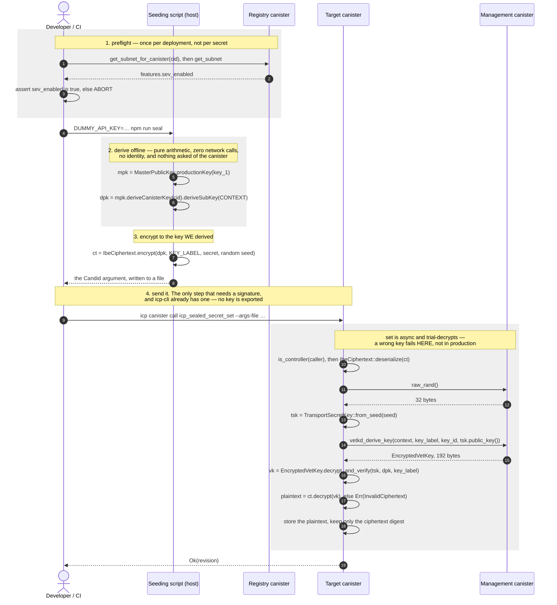
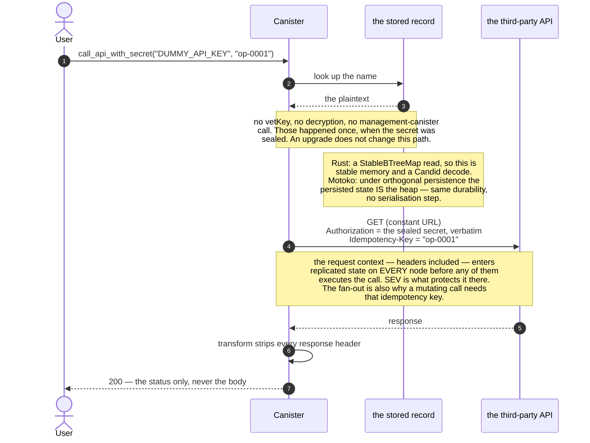

# Seeding a canister with secrets via vetKeys

A proof of concept for getting a secret — an API key, a token — into a **deployed**
canister without the plaintext ever appearing in an ingress message, a manifest, a
shell history, or a CI log.

The client encrypts the secret to a public key it derives **offline**, sends the
ciphertext in an ordinary update call, and only the target canister can recover the
plaintext. On a SEV-SNP subnet, memory encryption and a launch-measurement-keyed
data disk then protect the decrypted value from node operators.

This exists to be argued with. The interface is a starting proposal, not a standard.
For what productizing it would look like, see **[FOLLOW-UPS.md](./FOLLOW-UPS.md)**.

> **Do not deploy this as-is.** It ships a `secret_reveal` test hook — absent from a
> default build, but enabled by this repo's `icp.yaml`. Read
> [Security model](#security-model) for what this does and does not protect against.

---

## Contents

- [The problem this solves](#the-problem-this-solves)
- [Why it needs vetKD](#why-it-needs-vetkd)
  - [This uses vetKeys in the less common direction](#this-uses-vetkeys-in-the-less-common-direction)
  - [What the canister holds that lets it decrypt](#what-the-canister-holds-that-lets-it-decrypt)
- [The flow](#the-flow)
  - [Using the secret — the point of all this](#using-the-secret--the-point-of-all-this)
  - [Three decisions worth understanding](#three-decisions-worth-understanding)
- [Quick start](#quick-start)
  - [On mainnet](#on-mainnet)
- [Testing locally](#testing-locally)
  - [Confirming the right secret is deployed](#confirming-the-right-secret-is-deployed)
  - [Seeing the plaintext](#seeing-the-plaintext)
  - [Can I just add a getter?](#can-i-just-add-a-getter)
- [Client bindings](#client-bindings)
- [Wire format](#wire-format)
- [Interface](#interface)
- [Security model](#security-model)
  - [Who this protects against](#who-this-protects-against)
  - [Who it does not protect against, by design](#who-it-does-not-protect-against-by-design)
  - [When the controller *is* in your threat model](#when-the-controller-is-in-your-threat-model)
  - [Rotating a secret](#rotating-a-secret)
  - [HTTPS outcalls](#https-outcalls)
- [Do not lose the canister ID](#do-not-lose-the-canister-id)
- [Prerequisites for a real deployment](#prerequisites-for-a-real-deployment)
  - [Local vs mainnet — what a local run does and does not prove](#local-vs-mainnet--what-a-local-run-does-and-does-not-prove)
- [A Motoko canister could do this too](#a-motoko-canister-could-do-this-too)
- [Layout](#layout)
- [Deliberately out of scope](#deliberately-out-of-scope)
- [Licence](#licence)
## The problem this solves

icp-cli's current answer to "my canister needs an API key" is a plaintext canister
setting:

```yaml
settings:
  environment_variables:
    API_KEY: { path: ./secrets/api-key }   # sent in the clear via update_settings
```

That value travels in an ingress message and lands in replicated state unencrypted.
This repo is the encrypted equivalent.

## Why it needs vetKD

To send a secret to someone you encrypt to their public key, and they decrypt with
their private key. **A canister has no private key and cannot make one:** its whole
memory is replicated across every node of its subnet, checkpointed to disk, and
shipped to new nodes during state sync. Even its randomness is not private —
`raw_rand` derives from the round's random tape, a threshold signature every node
sees. A canister fundamentally has no secrets from its own subnet's replicas.

vetKD supplies the missing piece. The subnet *collectively* holds a master secret,
split across nodes so no single node has it. From that:

- **anyone** can compute, offline, the public key belonging to a given
  (canister, context) pair, starting from a published master public key; and
- **only that canister** can ask the subnet to reconstruct the matching private key,
  via `vetkd_derive_key`.

That is a real asymmetric keypair for a canister. "Identity-based" means the public
key is *derived from a name* — the canister id plus a context string — rather than
being a random blob someone had to generate and distribute. That is why step 1 below
is arithmetic you can do on a laptop before the canister has executed a single
instruction.

**Is IBE required?** You need some public-key encryption where the canister holds the
private half, and vetKD is the only mechanism on the IC that gives a canister a
private key at all. Threshold ECDSA and Schnorr produce *signing* keys, and the
management canister exposes no decryption operation for them, so they cannot receive
a secret. Given vetKD, IBE is both the natural fit and the one already implemented
and reviewed on both sides by `ic-vetkeys`.

### This uses vetKeys in the less common direction

Most vetKeys designs put the canister on the *outside* of the secret, and that is worth
knowing before reading further, because this one does the opposite.

| | transport key held by | plaintext ends up in |
|---|---|---|
| `KeyManager`, encrypted maps | the **client** | the user's browser |
| this PoC | the **canister** | canister memory |

In those designs the canister is a relay: it hands the encrypted key to the user, never
holds a transport secret key, and never sees the plaintext of anything. Nothing about
them needs a special subnet.

Here the canister is the **reader** — it is the thing that will use the secret, in an
outcall header — so it unwraps the key itself. Two consequences follow, and both are
deliberate:

- the vetKey and the decrypted secrets live in canister memory, which is replicated to
  every node and checkpointed to disk, so **the nodes of its subnet can see both**;
- protecting them there is SEV-SNP's job, not vetKD's.

**So what does this actually buy?** The secret never travels in the clear. Not in an
ingress message, not through a boundary node, not in a manifest, a shell history or a CI
log — and the ciphertext is useless to anyone but this one canister. That is a real and
sufficient goal on its own, and it is the part vetKD solves. Everything after the secret
lands is the subnet's problem, which is why this belongs on a fully SEV-SNP subnet and
nowhere else. See [the security model](#security-model).

### What the canister holds that lets it decrypt

The subnet will not hand a canister a key in the clear — every node would see it on the
way past. So the canister generates a **transport keypair** first, from `raw_rand`, and
sends only the public half in the `vetkd_derive_key` request.

Each node then encrypts *its share* of the derived key to that transport public key. What
comes back is an `EncryptedVetKey`: three curve points, ElGamal-shaped, that only the
matching transport **secret** key opens. That secret half never leaves the canister, and
it is the whole answer to "what does the canister know that nobody else does".

`decrypt_and_verify` does three things with it, in order:

1. **consistency** — a pairing check that the three points were produced together, so a
   malformed reply is rejected rather than silently unwrapped;
2. **unwrap** — subtract the transport secret key's contribution and the vetKey falls out;
3. **verify** — the vetKey *is* a BLS signature over the key label, so it is checked
   against the canister's derived public key before anything is decrypted with it. That
   rejects a malformed or substituted reply.

On the last point, note what this canister verifies *against*: the key `vetkd_public_key`
reported, not one derived from a master key compiled into the Wasm. That is circular —
the subnet vouching for itself — and it is a deliberate trade, so that one build runs
against a local network and mainnet with no configuration saying which. It costs little:
a subnet that would lie about its public key already holds the master key and could
decrypt everything anyway. **The non-circular check is on the client**, which derives the
key offline from a master key it ships and refuses to encrypt if the canister disagrees —
and that is the check that matters, because the client's request crosses boundary nodes
where the canister's inter-canister call does not.

That vetKey is simultaneously the IBE decryption key for anything sealed to the same
label, which is why one derivation opens every secret in the canister.

Note the boundary this does and does not move: **no node ever assembles the plaintext
vetKey** — each contributes a share encrypted to the transport key. But the canister
assembles it, and canister memory is replicated, so once decryption has happened the
nodes running that canister do hold it. That is the topology above, restated.

## The flow

Before the diagrams, the same thing in words — the mechanism is simpler than the API
names make it look.

**Nothing is set up.** The context and the key label are constants of this standard, and
the keypair is *implied* by those plus the canister's own id. Nothing is generated, nothing
is stored, and nothing has to be configured on either side.

**Seeding, after the canister is deployed:**

1. **Check the subnet is SEV-SNP**, because that is what protects the plaintext once the
   canister decrypts it. Once per deployment, not once per secret.
2. **Compute the canister's public key yourself**, on your own machine: take the network's
   published master public key (a hardcoded 96-byte constant), mix in the canister id, mix
   in the context. Pure arithmetic, no network call — you can do it before the canister has
   executed a single instruction.
3. **Encrypt the secret to it** — the result is the secret plus a fixed 136 bytes.
4. **Send the ciphertext** in an ordinary update call. That message is visible to boundary
   nodes and recorded like any other, and it is opaque. It is also bound to *this* canister
   id, so replaying it elsewhere is useless.
5. **The canister asks the subnet for its private key** and decrypts your ciphertext. It
   stores what came out and discards the ciphertext, keeping only its digest so you can
   still confirm your upload landed.

**Later, whenever the secret is used:** the canister reads it straight out of stable
memory. No vetKey, no decryption — those happened once, at step 5. **You never re-seed**,
and an upgrade changes nothing on this path.

The thing to notice is that steps 2 and 3 talk to nobody. The client asks the canister
*nothing* before encrypting, so there is no reply for anyone to tamper with — a key it was
told is a key it would have to trust, and it is never told one. What it does instead is
derive from constants and let step 5 be the judge: `set` decrypts before storing, so a
wrong key name, a wrong master key table or a wrong canister id becomes an error in front
of the operator rather than a value nobody discovers is unreadable until months later.

**Why not keep the ciphertext at rest?** Because it would not protect anything. The
plaintext reaches the heap the moment the canister uses the secret, and the heap is
replicated state, checkpointed to disk on every node — so sealing is what protects the
secret *in transit*, and SEV-SNP is what protects it at rest. Storing the ciphertext as
well would only mean the secret is lost forever if the subnet ever stops holding the vetKD
key. See [the security model](#security-model).



Using the secret afterwards is deliberately dull — which is the point of doing the work
at seal time:



**vetKD is still used, on two paths, and both are administrative:** `set` trial-decrypts
before storing, and `matches` decrypts the sealed candidate it is asked to compare. Each
needs the vetKey, which is cached — in the Rust canister on the heap, so the first such
call after an upgrade re-derives it; in the Motoko canister in persisted state, so it does
not. Neither pays anything on the path above.

**Cost.** A `vetkd_derive_key` with `key_1` costs **26_153_846_153 cycles**
(`test_key_1`: 10_000_000_000), the same locally and on mainnet. `vetkd_public_key` is
free. The figure comes from `VETKD_FEE` — 10B cycles at the 13-node reference subnet,
scaled by replication factor (`ic/rs/config/src/subnet_config.rs:130`), which the comment
there puts at 1 SDR cent per 10B.

It is **not paid per secret** — one label serves them all — and it is **not paid on
the path that spends one**. Only `set` and `matches` need a vetKey. The Rust canister
caches it on the heap, so the first such call after an upgrade re-derives it; the Motoko
canister keeps that cache in persisted state, so it does not. Either way, cost is no
reason to deviate from IBE.

### Using the secret — the point of all this

Sealing a secret is only useful if the canister can *use* it. The canonical case is an
authenticated HTTPS outcall, and `call_api_with_secret` in
[`rust/canister/src/lib.rs`](./rust/canister/src/lib.rs) is a working one.
`local-test.sh` step 10 asserts **both** branches:

```
== 10. the actual use case: an authenticated HTTPS outcall
  ok — the call SUCCEEDS with the sealed credential (200)
  ok — and FAILS with a wrong one (401): the value is what authenticated
```

```rust
let plaintext = keys::open(&name, &record).await?;      // decrypt (cached)
let token = core::str::from_utf8(plaintext.as_slice())?;

let request = HttpRequestArgs {
    url: DEMO_API_ENDPOINT.to_string(),                 // a CONSTANT — see below
    method: HttpMethod::GET,
    headers: vec![
        HttpHeader { name: "Authorization".into(),    value: token.to_string() },
        HttpHeader { name: "Idempotency-Key".into(),  value: idempotency_key },
        HttpHeader { name: "User-Agent".into(),       value: "…".into() },
    ],
    max_response_bytes: Some(2_048),
    transform: Some(transform_context_from_query("strip_response".into(), vec![])),
    ..Default::default()
};

let response = http_request(&request).await?;
u16::try_from(response.status.0)                        // ONLY the status
```

Four things in there are not stylistic.

**The URL is a constant, not a parameter.** `call_api(url, name)` would be an exfiltration
primitive — point it at a server you control and the secret is yours. A controller could
do that anyway by installing code, but shipping the capability as an endpoint is
gratuitous, and real canisters call a known API.

**Only the status code is returned.** Plenty of endpoints echo request headers —
`/headers`, `/anything`, most debug routes — so returning the body risks handing your own
`Authorization` header back to the caller, undoing the sealing completely.

**The transform is mandatory.** Every node performs the call independently and consensus
requires byte-identical responses, so per-node variation (`Date`, request ids, cookies) has
to be stripped or the call simply fails. Stripping headers also stops a hostile endpoint
reflecting the secret into replicated state.

This one strips headers and passes the **body** through, which is only safe because the
demo endpoint returns a constant. If yours returns a timestamp or a request id, normalise
the body too — and note that local testing will not catch the omission, because PocketIC
issues a single request (see [Local vs mainnet](#local-vs-mainnet--what-a-local-run-does-and-does-not-prove)).

**The idempotency key is mandatory for anything that mutates**, and for a reason specific
to ICP: that same fan-out means one logical outcall becomes **N real HTTP requests**, one
per node. A `GET` does not care. A `POST` that charges a card, sends an email or creates a
resource would happen N times unless the API deduplicates — so any non-idempotent call
needs a key the provider honours.

The key is a *parameter*, for the same reason Stripe makes it one: only the caller knows
whether this is a retry of one logical operation or a new one. Generating it inside would
make every retry a fresh operation, which is exactly the bug the header prevents. It needs
no special derivation — the request is built once during replicated execution and every
node sends those same bytes, so the value is already identical across the fan-out.

#### Why postman-echo, and why a public credential is fine here

The demo calls `https://postman-echo.com/basic-auth`, which accepts the documented
`postman:password` and rejects anything else. That distinction matters: an endpoint that
*ignores* `Authorization` — a status or health route — answers `200` whatever the canister
sends, which would demonstrate the plumbing while proving nothing about the secret.

Using a **published** credential is right for a demo and wrong for production, and the
difference is worth being precise about. A published credential proves nothing about
*secrecy*. But it is ideal for proving the *mechanism*, because the test can seal the
correct value and see `200`, then seal a wrong one and see `401`, with no setup and no real
key anywhere in the repo. Point the constant at your own API for anything real.

The sealed secret is the **complete `Authorization` header value**, not just a token, so
the same code works for `Bearer ghp_…`, `Basic dXNlcjpwYXNz`, or whatever scheme an API
expects.

And the exposure this creates, spelled out under [HTTPS outcalls](#https-outcalls): the
request context, headers included, enters replicated state on **every** node before any of
them executes the call. On a SEV-SNP subnet that is encrypted memory and measurement-keyed
disk; on any other subnet the secret is readable by every node operator the moment this
runs.

### Three decisions worth understanding

**The client computes the public key; it never asks for one.** If a client asked the
canister and believed the answer, anyone able to tamper with that response could
substitute a key they control and harvest the secret — and unlike the canister's
inter-canister calls, a reply to the client really does cross boundary nodes. So the
client derives the key from a master-key constant it ships with, a canister id, and a
context that is a constant of this standard. There is no request, so there is nothing to
tamper with.

The canister takes its own key from `vetkd_public_key`, which is authoritative for the
subnet it is on. Verifying against that is circular, but cheaply so: a subnet that would
lie about its public key already holds the master key and could decrypt everything
anyway.

**`set` decrypts before storing.** A wrong key name, master key table or canister id
otherwise produces a perfectly-accepted ciphertext that nobody discovers is unreadable
until a production call months later. Paying one key derivation at seal time turns that
into an error in front of the operator — and it is what makes the absence of any
cross-check endpoint safe.

**One key label serves every secret.** A single `vetkd_derive_key` unlocks all of them.
Per-secret labels would multiply the cost by N and buy nothing: there is no privilege
boundary inside a canister, since its code can derive the key for any label whenever it
likes.

The wire format calls it `key_label` rather than `identity` deliberately. In vetKD terms
it *is* the IBE identity — the `input` field of `vetkd_derive_key` — but on ICP
"identity" already means a caller's principal, and this is neither that nor a key. It is
a name selecting which key gets derived under the canister's keypair.

## Quick start

Requires Rust with the `wasm32-unknown-unknown` target, Node 22+,
[icp-cli](https://github.com/dfinity/icp-cli), and `candid-extractor`
(`cargo install candid-extractor`).

**In one command:** `./scripts/local-test.sh` — see [Testing locally](#testing-locally).

Step by step:

```bash
# 1. local network (this project uses port 8010 to avoid clashing with others)
icp network start local --background
icp deploy -e local

cd seed && npm install
CID=$(icp canister status sealed-secrets-rust -e local --json | jq -r .id)

# 2. check the subnet, once per deployment. Locally this can only be waived —
#    see "Local vs mainnet" below for what --local gives up.
npm run preflight -- --canister "$CID" --host http://127.0.0.1:8010 --local

# 3. encrypt a secret — read from the environment, never from argv.
#    Fully offline: no network call, no identity, nothing asked of the canister.
export DUMMY_API_KEY='sk-example-not-a-real-key'
npm run seal -- \
  --canister "$CID" \
  --name DUMMY_API_KEY \
  --source pocketic \
  --out /tmp/sealed.args

# 4. send it — this is the step that needs a controller, and icp-cli
#    signs it with the identity you already have configured
icp canister call "$CID" icp_sealed_secret_set --args-file /tmp/sealed.args -e local
```

**No identity is exported anywhere.** Encryption needs none: no key of yours goes into
the ciphertext, so anyone can produce one for this canister and only the canister can
open it. Only the *call* needs a signature, and `icp canister call` already has one.
That is why the two steps are separate.

```
derived pocketic:key_1 key a0d33e4e648337dafede99ae71fdc17a… for bkyz2-fmaaa-… offline
encrypted "DUMMY_API_KEY" (25 bytes → 161 bytes)
wrote /tmp/sealed.args
send it as a controller:
  icp canister call <id> icp_sealed_secret_set --args-file /tmp/sealed.args
```

`icp_sealed_secret_set` decrypts before storing, so it returns a revision only if the
ciphertext is genuinely readable. That is the only confirmation you need, and the only
one this interface offers.

Confirm the canister holds the value you expect — the production-safe check, which
discloses nothing in either direction:

```bash
DUMMY_API_KEY='sk-example-not-a-real-key' npm run seal -- \
  --canister "$CID" --name DUMMY_API_KEY --host http://127.0.0.1:8010 \
  --source pocketic --local --verify --out /tmp/check.args
icp canister call "$CID" icp_sealed_secret_matches --args-file /tmp/check.args -e local
# (true)
```

Or, if you want to watch the round trip rather than trust it:

```bash
icp canister call sealed-secrets-rust secret_reveal '("DUMMY_API_KEY")' -e local
```

There is no separate health-check endpoint. `set` is the health check: it derives the
vetKey, verifies it and decrypts, so a subnet that cannot serve vetKD, a wrong key name
or a mis-derived key all fail there, at deploy time, with a typed error.

### On mainnet

Drop `--local` and switch the master-key table:

```bash
npm run seal -- --canister <id> --name DUMMY_API_KEY \
  --host https://icp-api.io --source mainnet --out sealed.args
icp canister call <id> icp_sealed_secret_set --args-file sealed.args --network ic
```

The preflight then hard-fails unless the subnet reports `sev_enabled`. That is a real
check on mainnet, and it is the one thing a local run cannot rehearse at all.

> `--source` is not inferable from the key name. Mainnet and PocketIC each have a key
> called `key_1`, backed by **different** master public keys — necessarily so, since a
> local test environment cannot hold mainnet's master secret. What that means is that
> the key *name* does not identify a key, so the table has to be chosen explicitly.
> Choosing wrong yields ciphertext this canister cannot decrypt — which `set` catches,
> because it decrypts before storing, and which `rust/core/tests/golden.rs` pins by
> asserting the two derivations differ. `ic-vetkeys`' own
> `management_canister::compute_vrf` gets this wrong today — see
> [FOLLOW-UPS.md](./FOLLOW-UPS.md#a-bug-to-fix-while-in-there).

## Testing locally

One command does the whole round trip:

```bash
./scripts/local-test.sh
```

It starts a local network, deploys, seals a secret, **reads it back in the clear**, and
checks it survives an upgrade — then runs the negative cases. It also asserts two things
that are easy to let rot: that a build *without* `--features test-hooks` exposes no
endpoint that can observe a secret, and that the generated TypeScript bindings still
match the canister's `.did`.

Individually:

```bash
cargo test          # golden vectors, name validation, key derivation
cd seed && npm test # the SAME golden vectors, in TypeScript

# against a running canister. The suite brings its own caller — it needs both a
# controller and a non-controller, since one of the things it checks is that the
# controller gate gates — so authorise it once, then run it.
cd seed
icp canister settings update <id> --add-controller "$(npm run --silent e2e -- --print-principal)" -e local
npm run e2e -- --canister <id> --host http://127.0.0.1:8010 --source pocketic
```

The Rust, Motoko and TypeScript golden vectors are byte-for-byte identical on purpose:
three implementations cannot drift without one suite failing.

The e2e suite covers the cases that matter — ciphertext sealed to the wrong key label,
malformed blobs, invalid names, anonymous callers, that rejected writes leave no trace,
and that an overwrite replaces the stored value rather than shadowing it. Its first
assertion, that a well-formed seal succeeds, is also the derivation-agreement check:
`set` decrypts before storing, so it can only pass if client and canister derived the
same key.

### Confirming the right secret is deployed

The question an operator actually has is *"is the value I hold the one in the canister?"*
— and they already know the value, so they need one bit back, not the secret.

```bash
DUMMY_API_KEY='the-value-i-expect' npm run seal -- \
  --canister <id> --name DUMMY_API_KEY --source mainnet --verify --out check.args
icp canister call <id> icp_sealed_secret_matches --args-file check.args --network ic
```

```
(true)
```

The client seals its candidate with a fresh IBE seed exactly as it would for `set`, and
the canister decrypts both and compares in constant time. One bit comes back, and neither
side put the secret on the wire.

This is deliberately **not** a "return me a digest of the plaintext" endpoint:

- a digest of a low-entropy secret is brute-forceable offline by anyone who sees it, and
  replies cross a boundary node in the clear;
- sending `sha256(expected)` in the *request* would put the same brute-forceable digest on
  the wire;
- a ciphertext discloses nothing in either direction, and a boolean tells the caller
  everything a digest would.

It is controller-gated, because for anyone else it is an oracle for confirming guesses.
For a controller it discloses nothing new — they can already read the secret by installing
code that decrypts it.

**This is safe in production and is the intended verification path.**

### Seeing the plaintext

`matches` proves the right value is there. If you additionally want to *look* at it —
which is the whole point of a PoC someone is deciding whether to trust — build with
`--features test-hooks` (which `icp.yaml` does) and call `secret_reveal`.
`local-test.sh` step 8 prints both the sealed and the revealed value.

That feature exists for exactly one reason: convincing a human. Nothing automated needs it.
A successful `set` already proves the canister could decrypt, since `set` trial-decrypts
before storing, and `matches` covers verification. **A generalized implementation would
ship no such endpoint at all**, and neither should any real deployment — see
[Can I just add a getter?](#can-i-just-add-a-getter).

**The hook is genuinely absent from a default build, not merely hidden.** A canister
method is a wasm export, so this is checkable four ways, and all four agree:

| Check | Default build | `--features test-hooks` |
|---|---|---|
| Candid interface (`candid-extractor`) | absent | present |
| Wasm export section | no `canister_update secret_reveal` | present |
| Byte scan of the whole binary | **0** occurrences of the string | present |
| Calling it on a deployed canister | rejected, `IC0536 Canister has no update method 'secret_reveal'` | returns the value |

`local-test.sh` and CI assert the byte scan on every run, with a control (that
`icp_sealed_secret_set` *is* present) so the check cannot pass by reading the wrong file.

### Can I just add a getter?

Not in production — but the reason is more interesting than "it would leak the key",
because **a controller can obtain the secret anyway**. Two routes, no endpoint required:

1. **Install code that decrypts.** vetKD binds the key to the **canister ID**, not to the
   module hash — `vetkd_public_key` takes `{ canister_id, context, key_id }` and nothing
   about the code. Any module a controller installs on that canister can derive the same
   key, so a secret is bound to the canister, never to a particular code version.
2. **Read the state out of a snapshot.** `take_canister_snapshot`, then
   `read_canister_snapshot_data` with `kind = variant { wasm_memory : record { offset; size } }`.
   The canister stores the decrypted secret, so it is right there — and it would be there
   anyway the moment any version of this canister used it, since the plaintext reaches the
   heap and the heap is captured too.

So what does a getter actually cost you?

- **It ships the plaintext to a boundary node.** Replies are not encrypted end-to-end; the
  boundary node terminates TLS and sits *outside* the subnet's SEV-SNP trust boundary. That
  undoes in the outbound direction exactly what sealing achieved on the way in. (Note a
  `query` is the *less* bad choice here — an `update` reply is written into replicated state
  on every node, whereas a query reply is ephemeral.)
- **It destroys the property that makes the code auditable.** "The published code never
  returns the plaintext" is something a reader can verify by reading it. Replace it with
  "…unless the caller is a controller" and the guarantee now rests on the controller set
  being, and remaining, exactly what you believe.
- **It leaves no trace.** Installing leaky code changes the module hash, which is visible
  in the state tree. A call to a getter leaves nothing behind.

The corollary is narrower than it first looks. A controller can always get the secret, so
a getter does not hand *them* anything new — what it does is move the secret onto the
network and into an audit story that now depends on the controller set rather than on the
code. Keep it out, and the controller set stays the whole boundary. See
[Who it does not protect against](#who-it-does-not-protect-against-by-design).

None of this argues against `icp_sealed_secret_matches`: it returns one bit about a value
the caller already holds, not the value itself, so it survives every objection above.

## Client bindings

`seed/src/declarations/` is **generated** from `rust/canister/sealed_secrets_canister.did`
by [`@icp-sdk/bindgen`](https://www.npmjs.com/package/@icp-sdk/bindgen):

```bash
cd seed && npm run bindings
```

Regenerate whenever the canister interface changes; `local-test.sh` fails if you forget.

Only the NNS registry interface in `seed/src/idl.ts` is hand-written, because there is no
`.did` for it here and we need two of its ~20 methods. Everything else is generated: a
hand-written interface drifts from the canister silently, and the generated result types
are proper discriminated unions rather than `any`, so a mismatch is a compile error
rather than a runtime surprise.

## Wire format

```
context   = "icp-sealed-secrets-v1"        // which keypair
key_label = "icp-sealed-secrets-v1.keys"   // which key under it
```

Two constants, and that is the entire format. No version byte — the version is in the
string, and bumping it is the format break. No length prefixes — those existed to keep
two variable-length fields from colliding, and there are none. Golden values:

| Value | Bytes |
|---|---|
| `context` | `6963702d7365616c65642d736563726574732d7631` |
| `key_label` | `6963702d7365616c65642d736563726574732d76312e6b657973` |

Asserted byte-for-byte by [`rust/core/tests/golden.rs`](./rust/core/tests/golden.rs),
[`motoko/canister/test/Format.test.mo`](./motoko/canister/test/Format.test.mo) and
[`seed/src/format.test.ts`](./seed/src/format.test.ts) — three implementations that
cannot drift without one suite failing.

**Why the context needs nothing else.** The derivation is master key → canister id →
context, so the canister id already separates one canister from another, and the suite
separates sealed secrets from any other use of vetKD in the same canister. There is
nothing left for a client to be told.

**Why the label needs nothing else.** It is deliberately independent of the secret's
name: one label serves every secret, so a single `vetkd_derive_key` unlocks all of them
rather than N of them. Per-secret labels would multiply the cost by N and buy nothing,
because there is no privilege boundary inside a canister — its code can derive the key
for any label at any time.

Secret names are `[A-Za-z0-9_.-]{1,64}` — matching environment-variable conventions,
and sidestepping the Unicode confusables an arbitrary Candid `text` would admit. A name
is a map key in the canister; it is **not** part of any derivation and never reaches
vetKD.

## Interface

```candid
// required
icp_sealed_secret_set     : (text, blob)     -> (variant { Ok : nat64; Err : SealedSecretsError });
icp_sealed_secret_unset   : (text)           -> (variant { Ok; Err : SealedSecretsError });
icp_sealed_secret_list    : ()               -> (variant { Ok : vec SealedSecretEntry; Err : … }) query;

// optional
icp_sealed_secret_matches : (text, blob)     -> (variant { Ok : bool;  Err : SealedSecretsError });

// not part of the proposed standard — the worked example of USING a secret
call_api_with_secret      : (text, text)     -> (variant { Ok : nat16; Err : SealedSecretsError });
strip_response            : (TransformArgs)  -> (HttpRequestResult) query;
```

Install args are just `(record { key_name : text })`.

**`set` is the whole mechanism**, and it is the only method a sealing tool needs.
`unset` matters because revoking a leaked credential should not require an upgrade, and
`list` is the operational inventory — what does this canister hold, and did my write
land.

There is deliberately **no `info` endpoint**. The client needs nothing from the canister
in order to seal: the context and label are constants of this standard, the public key is
derived offline from the canister id, and the vetKD key name is something the deployer
already knows because they chose it at install. An `info` endpoint would only turn a
generic error into a specific one, one message earlier — and it would cost an update call
on every seal, because the canister's public key comes from `vetkd_public_key`.

- **`set` decrypts before storing, and that is the health check.** A ciphertext sealed
  with the wrong key name, the wrong master key table or the wrong canister id is
  rejected here, at deploy time, in front of the operator — rather than accepted happily
  and found unreadable at the first production call months later. It is also why there is
  no separate `self_test`: `set` exercises `vetkd_public_key`, `vetkd_derive_key`,
  verification and decryption, on real data.
- **`matches` is optional.** It answers *"is the value I hold the one you have stored?"*
  without either side disclosing it — but an operator who wants to guarantee the deployed
  value can simply `set` again: same cost, same outcome, one extra revision. It earns its
  place where writing is not permitted, such as a monitoring probe or an auditor who is a
  controller but should not mutate. Worth having; not worth requiring.
- **Errors are a typed variant**, so tooling can branch on `VetKdUnavailable` versus
  `InvalidCiphertext` rather than parsing prose.
- **`list` is controller-gated**, because names alone (`billing_live_key`, …) are useful
  reconnaissance.
- **Nothing derived from a plaintext is ever exposed.** A digest of the plaintext would
  be an offline guessing oracle for low-entropy secrets; `ciphertext_sha256` is a digest
  of a *randomised* ciphertext, so it reveals nothing — while still letting the client
  that produced it recognise its own upload. It cannot confirm a value is *correct*:
  sealing the same secret twice gives different digests. That question is `matches`.
- **There is no `get` in a default build.** No endpoint returns a plaintext. The
  `test-hooks` feature adds `secret_reveal`, which does — see
  [Seeing the plaintext](#seeing-the-plaintext) and
  [Can I just add a getter?](#can-i-just-add-a-getter).
- **`call_api_with_secret` and `strip_response` are not part of the proposed standard.**
  They are the worked example of *using* a sealed secret — see
  [Using the secret](#using-the-secret--the-point-of-all-this). A real canister writes its
  own equivalent; nothing in the standard prescribes how the secret gets used.
- **Discovery needs no new mechanism.** `icp canister metadata <id> candid:service`
  returns the full interface with no update call, so tooling can check which of these a
  canister has and say what is missing rather than calling a method that is not there.

## Security model

**What sealing gives you.** The secret is encrypted to a key derivable only by this
canister on this subnet. It never appears in an ingress message, a Candid argument, a
shell history, a CI log, or the canister's interface. The ciphertext is bound to the
canister id, so replaying it elsewhere is useless.

**What it does not.** Once decrypted, the plaintext is in the Wasm heap — which is
replicated state, checkpointed to disk on every node, and shipped in state sync.
Keeping it out of `StableBTreeMap` does **not** keep it off disk. On a non-TEE subnet
a node operator reads it out of a checkpoint.

**What SEV-SNP adds — load-bearing, not a bonus.** Guest memory encrypted under a key
the hypervisor cannot access, plus a LUKS data partition keyed to the SEV launch
measurement. This is the *only* thing that moves "node operators can read the
plaintext" to "cannot". **Without a SEV-SNP subnet this scheme protects the secret in
transit and at rest in the ingress history, and nothing more.**

### Who this protects against

- **Anyone on the network path.** Boundary nodes, and anyone reading ingress messages or
  blocks, see IBE ciphertext. The plaintext never crosses in the clear.
- **Node operators**, via SEV-SNP — and only via SEV-SNP. On any other subnet they can read
  the plaintext out of a checkpoint the moment the canister decrypts.
- **Every other principal**, via controller-gating on every endpoint that touches a secret.
- **Your repo, your CI logs, your shell history**, because the value is read from the
  environment and never from argv or a committed file.

### Who it does not protect against, by design

**The controller can read the secret.** They can install code that decrypts it — vetKD
binds the key to the *canister ID*, not the module hash, so any module they install can
derive the same key — or take a snapshot and read the secret straight out of the canister's
memory. There is no way to pin a sealed secret to a particular code version.

For the case this PoC is built for, that is not a defect. **The controller is whoever
seeded the secret; they already know it.** The controller set is the access-control
boundary, and what matters is that it is small, known, and not shared — not that it is
empty.

Also not protected: **metadata**. The destination host of an outcall (TLS SNI, DNS),
timing, and request and response sizes are outside the encrypted payload. The credential
is not.

And nothing here proves the subnet is SEV-SNP. Verify that out of band.

### When the controller *is* in your threat model

A different shape of application — one holding *other people's* secrets, where users need
protection from whoever operates the canister — does put the controller in scope. Then a
single controller key is not enough, and the answer is **SNS or NNS governance**, so that
installing new code requires a public proposal and a vote rather than one private key.
That does not make extraction impossible; it makes it public.

**Blackholing is not the answer, and cannot be here.** `icp_sealed_secret_set` is
controller-gated, so a canister with no controllers can never be seeded and can never be
rotated. You would be choosing a canister whose API key can never be changed — and API
keys expire, leak, and get revoked. That is a worse failure than the one it avoids.

Blackholing is the wrong instinct here on both counts: it imports a threat model from a
different problem, and it contradicts this design — a blackholed canister can never be
seeded or rotated, because `set` is controller-gated.

### Rotating a secret

Seal it again. `set` decrypts the new ciphertext, replaces the stored value and bumps the
revision — so the next use picks up the new value with no upgrade and no downtime.

```bash
DUMMY_API_KEY='the-new-key' npm run seal -- \
  --canister <id> --name DUMMY_API_KEY --source mainnet --out sealed.args
icp canister call <id> icp_sealed_secret_set --args-file sealed.args --network ic
```

The e2e suite covers this: *overwriting bumps the revision* and *an overwrite replaces the
stored value rather than shadowing it*.

There is no separate mechanism for rotating the *key label*, and deliberately so. An
earlier draft carried an epoch in the label so a future `rotate` could move new writes
onto a new key. It was dropped: rotating the label is almost never what anyone wants, and
when it is, the suite string is the version and bumping it is the break. If a secret
leaks you rotate the secret, which is the paragraph above.

### HTTPS outcalls

Using a secret in an outcall header does **not** widen the trust boundary beyond what
decryption already crossed, but it is worth knowing exactly where the bytes go:

| Where the plaintext is | Protected on a SEV subnet? |
|---|---|
| `CanisterHttpRequestContext { url, headers, body }` in replicated state, on every node, checkpointed | ✅ memory encryption + measurement-keyed LUKS |
| The request built by `ic-https-outcalls-adapter` | ✅ it is a GuestOS service, inside the SEV guest |
| On the wire to the endpoint | ✅ TLS, terminated by the adapter |
| Through a SOCKS proxy on another node | ✅ the proxy sees ciphertext only — TLS wraps the tunnel |

**A trap:** `flexible_http_request` lets a canister set `replication.total_requests`
as low as 1. That reduces how many nodes open a connection, but **not** how many hold
the header bytes — the request context enters replicated state before any node
executes it. It is an egress knob, not a confidentiality control.

Still leaked even on SEV, because it is outside the encrypted payload: the destination
host (TLS SNI, DNS), timing, and request/response sizes. The key itself is not.

## Do not lose the canister ID

vetKD derives the key from the **canister ID**. That is what makes a ciphertext decryptable
by exactly one canister — and it is also a durability requirement most projects do not have.

icp-cli records mainnet canister IDs in `.icp/data/mappings/<environment>.ids.json`, and
that directory is **deliberately not gitignored** here. Losing it is not the usual
inconvenience of having to look an ID up on the dashboard: if it leads to deploying a
*replacement* canister, every secret ever sealed to the old one becomes permanently
unreadable, because the key derived from the old ID cannot be derived by the new canister.

Commit `.icp/data/`. Only `.icp/cache/` is disposable.

The same reasoning applies to canister migration: moving a canister to another subnet
changes nothing (the ID travels with it), but re-creating one does.

## Prerequisites for a real deployment

**The subnet's nodes must be SEV-SNP.** That is the whole prerequisite, and it is
load-bearing rather than a bonus: the canister decrypts the secret into replicated state,
so without memory encryption a node operator reads the plaintext out of a checkpoint.
The seeding script resolves the canister's subnet and refuses to seal unless the registry
reports `features.sev_enabled`, with `--allow-unverified-sev` for the local case where the
property cannot be reported at all.

**The vetKD key is deliberately not a prerequisite of the subnet.** `vetkd_derive_key` is
routed to a subnet enabled for the key, which need not be the caller's, so a canister on a
keyless subnet derives fine. Whether the key is usable is settled at seal time by
`icp_sealed_secret_set`, which decrypts before storing.

### Local vs mainnet — what a local run does and does not prove

`icp network start` always creates NNS, **fiduciary**, **TestThresholdKeys** and
application subnets. PocketIC attaches vetKD keys only to the **II and fiduciary**
subnets (`pocket_ic.rs`: `if subnet_kind == II || Fiduciary` → `key_1`, `test_key_1`,
`dfx_test_key`), which is where local `key_1` comes from.

| | Local / PocketIC | Mainnet |
|---|---|---|
| **Registry reports the subnet's vetKD keys** | ✅ **accurate** — fiduciary shows `key_1`, application shows none | ✅ accurate |
| **Caller's subnet must hold the key** | ❌ no — routed to a subnet that has it | ❌ no — same routing |
| **`features.sev_enabled`** | ❌ always `null` — SEV cannot be simulated | ✅ reported |
| **Outcall fan-out** | ❌ **one** real HTTP request, whatever the registry says | ✅ one per node (13, 34, …) |

Two consequences, and they point in opposite directions.

**The canister's own subnet does not need the vetKD key.** This is worth stating because
it is easy to assume the opposite. `vetkd_derive_key` is routed like every other chain-key
request — `route_chain_key_message` sends it to a subnet enabled for that key
(`system_api/routing.rs`) — so the check the replica performs happens on the *destination*
subnet, after routing. Deploy this PoC locally and it lands on the *application* subnet,
which holds no vetKD keys, and derivation succeeds. Mainnet behaves the same way.

That is why the preflight does not gate on the key: it would refuse to seal in situations
that work. What it does report is the keys the subnet happens to hold, as information.
Whether the key is usable at all is settled one step later, authoritatively —
`icp_sealed_secret_set` derives and decrypts before storing, so an unusable key surfaces
as a typed error at seal time rather than in production.

**Outcalls do not fan out locally, and that hides two classes of bug.** The local registry
advertises 13 nodes for the application subnet, but PocketIC is a single process with one
HTTPS-outcalls adapter client per subnet, so it issues exactly **one** real request. Proven
by pointing the demo at `postman-echo.com/time/now`, whose body changes every second: it
returned `200`. Thirteen nodes fetching that would have disagreed and consensus would have
failed.

So both of these pass locally and break on mainnet:

- **A missing idempotency key on a mutating call.** Locally the request happens once. On a
  34-node subnet it happens 34 times, and without a key the API honours, so does the
  charge, the email or the row.
- **A response body that varies per node.** The transform in this PoC strips response
  *headers*, which is enough for a constant body. If your endpoint returns a timestamp, a
  request id or anything else that differs between fetches, the transform has to normalise
  the **body** too, or every call fails on mainnet while passing locally.

**SEV cannot be exercised locally at all.** `sev_enabled` is `null` for every local
subnet, so `--allow-unverified-sev` is unavoidable locally and says nothing about your
deployment. On mainnet it is the check that carries the entire security argument: without
a SEV-SNP subnet, node operators can read the plaintext out of a checkpoint the moment
the canister decrypts it, and this scheme protects the secret only in transit and in the
ingress history.

**So the mainnet checklist is not optional and cannot be rehearsed locally:**

1. Confirm the canister's subnet reports `sev_enabled = true`. The seeder's preflight
   does this, and it is the check the whole security argument rests on.
2. Seal one secret immediately after install, with `--source mainnet`. That exercises
   the full derive-and-decrypt path, and the client's offline derivation is compared
   against what the canister reports before anything is encrypted — so a wrong master
   key table, a wrong key name, or a subnet that cannot serve vetKD all fail here.

## A Motoko canister could do this too

The Rust canister here is the reference implementation, but the pattern should not
be Rust-only. The obstacle was that Motoko has no BLS12-381, so a Motoko canister
could receive a sealed secret and never open it.

**`motoko/canister/` now does the whole thing**, on this repo's own crypto: it
calls `vetkd_derive_key`, verifies the reply against a master key compiled into
its Wasm, decrypts the sealed secret, and authenticates an HTTPS outcall with it —
returning `200`, and `401` when the credential is wrong, which is what shows the
secret's *value* is doing the work. It survives an upgrade with no re-seeding. It
speaks the identical Candid interface, so `seed/` drives it unchanged.
`scripts/local-test.sh` steps 13–14 run that round trip on every CI build, including
the same 17 negative-case assertions the Rust canister faces.

`motoko/` holds an **experimental, unaudited** implementation, split the way Rust
splits it — [`bls12-381/`](./motoko/bls12-381) for the curve,
[`vetkeys/`](./motoko/vetkeys) for the vetKD layer on top, so the second is
exactly what `mo:ic-vetkeys` is missing. Between them: the
field tower, both curve groups, the optimal ate pairing, RFC 9380 hash-to-curve,
IBE decryption and vetKey verification. It costs about 5.4 billion instructions
cold (verify plus decrypt) against the 40 billion an update call gets, and it is
paid once.

It is a library, not a canister. Fetching the vetKD reply is an ordinary
management-canister call Motoko can already make via `mo:ic-vetkeys`'
`ManagementCanister.mo`.

It also derives public keys offline from a master key compiled into the canister
(`PublicKey.mo`), which is how a canister checks the subnet's reply against a
constant an auditor can read rather than asking the subnet to vouch for itself.
Its output matches `rust/core`'s byte for byte, on the same vectors.

Three tests carry the weight: it decrypts a ciphertext generated by the Rust
reference, it verifies a real `vetkd_derive_key` reply taken from `ic-vetkeys`'
own test suite, and it derives the same public keys `rust/core` does.

It is a demonstration, not a recommendation — read
[motoko/README.md](./motoko/README.md) before considering it for anything. It is
unaudited.

Note what this does *not* change: the Motoko canister is only as trustworthy as
the BLS12-381 underneath it, and no cryptographer has reviewed that. What it does
change is the conversation — from "could Motoko do this?" to "here is an
implementation to review".

## Layout

```
rust/core/             wire format + offline key derivation. No canister APIs; host-testable.
rust/core/tests/       golden vectors — the contract other implementations must meet.
rust/canister/         the Rust canister: endpoints, stable store, key derivation, vetKey cache.
rust/vectorgen/        emits motoko/vectors.json from the Rust reference.
seed/src/index.ts      the seeding script: derives offline, encrypts, writes a
                       Candid argument. No network, no identity.
seed/src/preflight.ts  the subnet SEV-SNP check — a separate command, because it
                       asks the registry and sealing asks nobody.
seed/src/e2e.ts        the end-to-end suite, against a deployed canister.
seed/src/declarations/ GENERATED from the .did — do not edit; `npm run bindings`.
motoko/bls12-381/      EXPERIMENTAL, UNAUDITED BLS12-381 for Motoko.
motoko/vetkeys/        EXPERIMENTAL, UNAUDITED vetKD layer on it — what mo:ic-vetkeys lacks.
motoko/canister/       the Motoko canister, mirroring rust/canister. Works end to end.
motoko/vectors.json    generated by rust/vectorgen; both Motoko packages assert it.
scripts/local-test.sh  the whole round trip, both canisters. Takes a phase:
                       build | setup | rust | motoko, or none for all of it.
scripts/check-all.sh   everything CI runs except the replica. Run before pushing.
scripts/check-diagrams.mjs  parses the mermaid blocks in this file so they cannot rot.
icp.yaml               both canisters; local (port 8010) and ic environments.
.github/workflows/     one workflow per thing tested — rust, motoko, client, e2e.
                       See its README for which answers what.
.icp/cache/            gitignored — recreatable.
.icp/data/             appears after a mainnet deploy. NOT gitignored — commit it.
```

The core/canister split is deliberate. It keeps the format layer free of `ic-cdk` and
`ic-stable-structures`, which is the shape a library version would need — see
[FOLLOW-UPS.md](./FOLLOW-UPS.md).

## Deliberately out of scope

Rotation, using `matches` to make `icp deploy` idempotent, the macros that would make this
three lines in someone else's canister, splitting `ic-vetkeys` itself along a Cargo
feature, and any icp-cli integration. All of it is discussed in
**[FOLLOW-UPS.md](./FOLLOW-UPS.md)**; none of it belongs in something whose job is to start
a design conversation.

## Licence

Apache-2.0.
