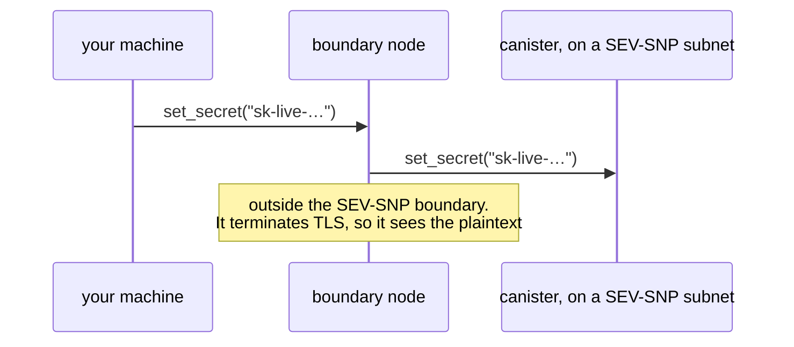
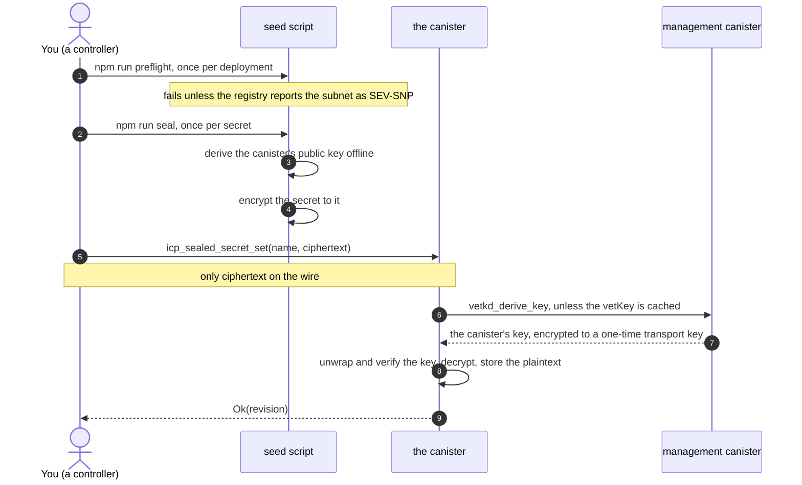

# Seeding a canister with secrets via vetKeys

A proposal for getting a secret — an API key, a token — into a canister on a
**SEV-SNP subnet** without it ever travelling in plaintext, and a standard
interface for doing it. The [`main`](../../tree/main) branch has the bare
mechanism; this branch builds it out into something to argue with.

> **Do not deploy this as-is.** This repo's `icp.yaml` enables a `secret_reveal`
> test hook that a default build does not have. See [docs/security.md](./docs/security.md).

## The problem

A canister on a SEV-SNP subnet can keep a secret: its memory is encrypted, so node
operators cannot read what it holds. The weak point is getting the secret there.

icp-cli's current answer to "my canister needs an API key" sends it in plaintext:

```yaml
settings:
  environment_variables:
    API_KEY: { path: ./secrets/api-key }   # sent in the clear via update_settings
```

So does any plain `icp canister call`:



The same plaintext also sits in the call's arguments, and from there in shell
history and CI logs. **So the secret must never be sent in plaintext.** It has to
be encrypted before it leaves your machine, to a key that only the target canister
can use.

## Why vetKD

That needs a keypair for the canister: a public key you can encrypt to, and a
private key only the canister can use. vetKD provides exactly that.

- **Anyone** can compute a canister's public key **offline**, from a published
  master public key, the canister id and a context. No network call, and nothing
  to trust beyond the master public key the client ships.
- **Only that canister** can obtain the matching private key, by calling
  `vetkd_derive_key`. The derivation takes the caller's canister id as an input,
  so no other canister can ask for it.

So everything on the way sees only ciphertext, and it is useless to anyone but
the one canister it was sealed to. As always with vetKD, that holds as long as
fewer than a threshold of the key-holding subnet's nodes collude.

### Couldn't the canister just generate a keypair?

It could. `raw_rand` cannot be read from outside the subnet, and a key made from it
would sit in the same SEV-SNP-protected memory as the secrets themselves, so
confidentiality is not what decides it. The trade-offs are:

| | vetKD | a key the canister generates |
|---|---|---|
| getting the public key | the client computes it offline | the client fetches it from the running canister, as a certified reply |
| sealing before the canister has run | yes, the id is enough | no: deploy, run, fetch first |
| after a reinstall | the same key, so earlier ciphertexts stay readable | a new key, so earlier ciphertexts are unreadable |
| where the key lives | derived when needed, never stored | in canister memory, which must be kept |
| what it rests on | a threshold of the key-holding subnet's nodes | the canister's own subnet |
| cost | 26 billion cycles per derivation, then cached | none |

For one credential in a canister you control, that is a close call. vetKD wins once
you want to seal before deploying, or need ciphertexts to outlive a reinstall.

## The proposed interface

```candid
// required
icp_sealed_secret_set     : (text, blob) -> (variant { Ok : nat64; Err : SealedSecretsError });
icp_sealed_secret_unset   : (text)       -> (variant { Ok; Err : SealedSecretsError });
icp_sealed_secret_list    : ()           -> (variant { Ok : vec SealedSecretEntry; Err : … }) query;

// optional
icp_sealed_secret_matches : (text, blob) -> (variant { Ok : bool; Err : SealedSecretsError });
```

- **`set` decrypts before storing.** A ciphertext sealed to the wrong key is
  rejected in front of whoever is seeding it, not discovered in production months
  later. That makes `set` the health check too.
- **`matches` confirms a deployed value without revealing it.** Seal the value you
  expect; the canister compares and answers one bit.
- **No endpoint returns a plaintext in a default build**, and every endpoint that
  touches a secret is controller-gated.
- **Nothing to configure.** The vetKD context and key label are constants of the
  standard, `icp-sealed-secrets-v1` and `icp-sealed-secrets-v1.keys`, so a client
  needs only the canister id and which vetKD key it uses.

[docs/interface.md](./docs/interface.md) has the full semantics and the reasoning
behind each choice.

## How it works



Encrypting needs no identity, so anyone can seal a secret _to_ the canister, but
only it can open one. Sending the call is the one step that needs a signature,
from a controller.

After that, **using** the secret costs nothing extra. The canister stores the
plaintext, so an HTTPS outcall reads it straight from its stable state: no vetKD
call, no decryption, and no re-seeding. `call_api_with_secret` is a worked
example, not part of the standard; [docs/outcalls.md](./docs/outcalls.md) covers
what it gets right.

## Quick start

Requires Rust with the `wasm32-unknown-unknown` target, Node 22+,
[icp-cli](https://github.com/dfinity/icp-cli), `candid-extractor`
(`cargo install candid-extractor`), `ic-wasm`, [mops](https://mops.one) and `jq`.

```bash
./scripts/local-test.sh
```

That deploys both canisters locally, seals, spends and reads back secrets, and
runs the negative cases. Step by step:

```bash
icp network start local --background
icp deploy -e local
cd seed && npm install
CID=$(icp canister status sealed-secrets-rust -e local --json | jq -r .id)

# once per deployment. Locally SEV cannot be reported, so it can only be waived.
npm run preflight -- --canister "$CID" --host http://127.0.0.1:8010 --local

# encrypt: offline, no identity. The value comes from the environment, never argv;
# for a real secret, set it from a secret store rather than inline.
export DUMMY_API_KEY='sk-example-not-a-real-key'
npm run seal -- --canister "$CID" --name DUMMY_API_KEY --source pocketic --out /tmp/sealed.args

# send it: the one step that needs a controller
icp canister call "$CID" icp_sealed_secret_set --args-file /tmp/sealed.args -e local
```

On mainnet, run the preflight without `--local` and seal with `--source mainnet`.
Mainnet and a local network both have a `key_1`, backed by different master keys,
so the source must match the network. [docs/deployment.md](./docs/deployment.md)
has the mainnet checklist and what a local run cannot prove.

## Security model, in short

- **Protected:** the secret on the way in (only ciphertext crosses the network),
  and at rest from node operators, **but only on a SEV-SNP subnet**. On any other subnet a node operator can read the plaintext out of a
  checkpoint once the canister has decrypted it.
- **Not protected, by design:** the controller, who can install code that reads
  the secret or read it out of a snapshot. The controller is whoever seeded it,
  and already knows it.
- **Not proven by this repo:** that a subnet really is SEV-SNP. The preflight reads
  a registry flag, not an attestation.

[docs/security.md](./docs/security.md) has the full model, including what to do
when the controller _is_ in your threat model.

## More

| | |
|---|---|
| [docs/design.md](./docs/design.md) | how the canister decrypts, and the decisions behind the design |
| [docs/interface.md](./docs/interface.md) | the interface in full, confirming a value, and why there is no getter |
| [docs/deployment.md](./docs/deployment.md) | SEV-SNP, local vs mainnet, keeping the canister id, testing |
| [docs/outcalls.md](./docs/outcalls.md) | using a secret in an HTTPS outcall safely |
| [docs/security.md](./docs/security.md) | the security model |
| [FOLLOW-UPS.md](./FOLLOW-UPS.md) | what productizing this would take: `ic-vetkeys`, icp-cli, a Motoko library |
| [motoko/](./motoko/README.md) | the same canister in Motoko, on **experimental, unaudited** crypto |

## Layout

```
rust/core/          wire format and offline key derivation, host-testable
rust/canister/      the Rust canister, the reference implementation
rust/vectorgen/     generates motoko/vectors.json from the Rust reference
motoko/canister/    the same canister in Motoko
motoko/bls12-381/   EXPERIMENTAL, UNAUDITED BLS12-381 for Motoko
motoko/vetkeys/     EXPERIMENTAL, UNAUDITED vetKD layer on it
seed/               the client: seal, preflight, and the e2e suite
scripts/            seal.sh, local-test.sh (phases: build, setup, rust, motoko), check-all.sh
.github/workflows/  one workflow per thing tested; its README says which answers what
.icp/data/          canister ids after a mainnet deploy: commit it (docs/deployment.md)
```

`rust/core` is separate from the canister so the format layer has no endpoints or
state, the shape a library version would need.

## Licence

Apache-2.0.
