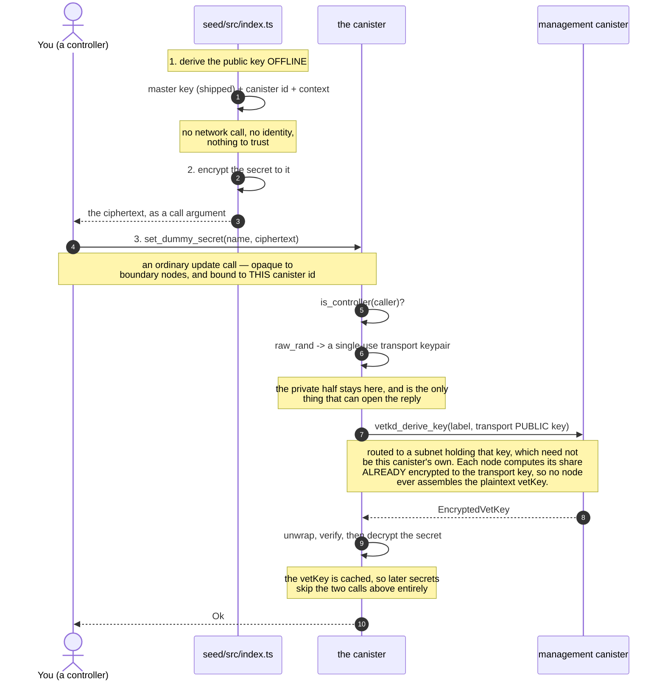

# Seeding a canister with secrets, via vetKeys

A minimal proof of concept: get secrets — an API key, a token, a private key,
anything — into a **deployed** canister without the plaintext ever appearing in
an ingress message, a manifest, a shell history, or a CI log.

The client encrypts to a public key it derives **offline**, sends the ciphertext
in an ordinary update call, and only the target canister can recover the
plaintext.

```bash
DUMMY_SECRET=super-secret-value ./scripts/seal.sh dummy-secret-rust exchange-rate-api-key
```

Two endpoints, two implementations of them, and one script. Everything on the
path is meant to be read start to finish:

| file                                                           | size      |
| -------------------------------------------------------------- | --------- |
| [`rust/canister/src/lib.rs`](./rust/canister/src/lib.rs)       | 205 lines |
| [`motoko/canister/src/Main.mo`](./motoko/canister/src/Main.mo) | 215 lines |
| [`seed/src/index.ts`](./seed/src/index.ts)                     | 164 lines |

> A fuller version of this — a proposed standard interface, subnet preflight
> checks, rotation, key-diffing, an HTTPS-outcall example, and the reasoning
> behind each — lives on the
> [`standardization-proposal`](../../tree/standardization-proposal) branch. This
> branch is deliberately the bare mechanism.

## Why this needs vetKD

You want to hand a secret to one specific canister so only it can read it. That
is what public-key encryption is for — the recipient needs a public key you can
encrypt to, and a private key only they can use.

**A canister cannot keep a private key its own subnet cannot see.** Its entire
memory is replicated to every node of that subnet, written to disk in
checkpoints, and shipped to new nodes during state sync. Its randomness is no
different — `raw_rand` comes from the round's random tape, a threshold signature
every node of the subnet holds. Whatever it generates, the subnet has too.

**vetKD supplies the missing half.** Subnets that hold a vetKD key hold a master
secret, split across their nodes so no single node has it. From that:

- **anyone** can compute, offline, the _public_ key for a given (canister,
  context) pair — no network call, no permission;
- **only that canister** can have the matching private key reconstructed, by
  calling `vetkd_derive_key` on the management canister.

That is a real keypair for a canister, which is the thing that did not exist
before. The call is routed like any other chain-key request, to a subnet enabled
for that key — which need not be the calling canister's own. What binds the key
to _your_ canister is not which subnet serves it, but that the derivation takes
the **caller's** canister id as an input.

### This uses vetKeys in the less common direction

Most vetKeys designs put the canister on the _outside_ of the secret, and that
is worth knowing before reading any further, because this one does the opposite.

|                              | transport key held by | plaintext ends up in |
| ---------------------------- | --------------------- | -------------------- |
| `KeyManager`, encrypted maps | the **client**        | the user's browser   |
| this PoC                     | the **canister**      | canister memory      |

In those designs the canister is a relay: it hands the encrypted key to the user,
never holds a transport secret key, and never sees the plaintext of anything.
Nothing about them needs a special subnet.

Here the canister is the **reader** — it is the thing that will use the secret,
in an outcall header — so it unwraps the key itself. Two consequences follow, and
both are deliberate:

- the vetKey and the decrypted secrets live in canister memory, which is
  replicated to every node and checkpointed to disk, so **the nodes of its subnet
  can see both**;
- protecting them there is SEV-SNP's job, not vetKD's.

**So what does this actually buy?** The secret never travels in the clear. Not in
an ingress message, not through a boundary node, not in a manifest, a shell
history, or a CI log — and the ciphertext is useless to anyone but this one
canister. That is a real and sufficient goal on its own, and it is the part
vetKD solves. Everything after the secret lands is the subnet's problem, which is
why this belongs on a fully SEV-SNP subnet and nowhere else.

## The flow



Two things worth noticing. The client derives the key **itself**, from a master
public key shipped in the vetKeys library — it never asks the canister what to
encrypt to, because anyone able to tamper with that reply could hand it a key
they control.

And **only the sending step involves you.** Encrypting is pure computation with
no key of yours in it, so anyone can seal a secret _to_ this canister — and only
the canister can open it. The call is what needs a signature, from a controller.

### What comes back

Not a key: an `EncryptedVetKey`. Two things about that are worth knowing, because
neither is visible in the call.

**The vetKey is a BLS signature** over `KEY_LABEL`. That is why "derive the key
for this label" and "sign this label" are the same operation, and it is what
makes the reply verifiable at all.

**It arrives encrypted to something only this canister holds.** Before asking,
the canister generates a single-use _transport keypair_ from `raw_rand` and sends
only the public half. That public half goes into the share computation itself, so
each node produces a share already encrypted under it and no node ever assembles
the plaintext vetKey.

The private half never leaves, and it is the whole answer to "how can the
canister decrypt this?": `decrypt_and_verify` uses it to strip the blinding, then
checks the result really is a signature over `KEY_LABEL`, which is what makes a
forged reply useless. The algebra is in
[`ic-vetkeys`](https://github.com/dfinity/vetkeys).

"Only this canister" means only it, among everyone outside its subnet. `raw_rand`
is deterministic given the subnet's random tape, so its own nodes could recompute
the transport key — which changes nothing, since they can read the canister's
memory regardless.

## Storing more than one secret

Costs exactly one derivation, no matter how many. A canister holding secrets
usually holds several — credentials for the HTTPS outcalls it makes, say — and
every one of them is sealed to the same **label**: `KEY_LABEL`, the IBE identity.
One derived key opens every ciphertext sealed to it. The per-secret names are map keys in the canister's own
storage; they are not part of any derivation and never reach vetKD.

```text
caller  = your canister id      the replica fills this in; cannot be forged
context = "dummy-secret-poc"    your namespace
label   = "dummy-secrets"       one key, derived once and cached

   ├── secrets["exchange-rate-api-key"]   all sealed to that one key
   └── secrets["rpc-provider-key"]
```

Giving each secret its own label would cost a separate `vetkd_derive_key` — 26
billion cycles each — and buy nothing, because there is no privilege boundary
inside a canister to enforce: the code can derive any label's key whenever it
likes. Distinct labels earn their cost when the _recipients_ differ, as in a
per-user design where one user's key must not open another's data.

The key is cached after first use. Nothing at runtime can invalidate it:
derivation is deterministic in `(caller, context, label, key_id)`, none of which
depends on the secrets. Without the cache every write would pay a derivation and
a round through consensus for a key that never changes.

Both canisters drop the cache on upgrade, so the first write afterwards derives
again. Motoko could keep it — orthogonal persistence gives that for free — but
then editing `CONTEXT` or `KEY_LABEL` would leave a cache serving the key for the
old values until the canister was reinstalled. A production canister might take
that trade; a PoC should not hand you the sharp edge.

## Try it

Needs [icp-cli](https://github.com/dfinity/icp-cli), a Rust toolchain with the
`wasm32-unknown-unknown` target, [mops](https://mops.one), and Node 18+.

```bash
./scripts/local-test.sh
```

That starts a local network, deploys both canisters, seals two secrets into
each, reads them back, and checks they match. To do it by hand:

```bash
icp network start local --background
icp deploy -e local --yes

DUMMY_SECRET=super-secret-value ./scripts/seal.sh dummy-secret-rust exchange-rate-api-key
DUMMY_SECRET=another-value      ./scripts/seal.sh dummy-secret-rust rpc-provider-key

icp canister call dummy-secret-rust get_dummy_secret '("exchange-rate-api-key")' -e local
# (variant { Ok = opt "super-secret-value" })
```

The second seal costs no derivation — the canister cached the key from the
first. `scripts/seal.sh` wraps two steps that are worth seeing apart, because only
one of them involves you:

```bash
CID=$(icp canister status dummy-secret-rust -e local -i)

# 1. encrypt — offline, and with no identity involved
DUMMY_SECRET=super-secret-value npm --prefix seed run seal -- \
  --canister "$CID" --name exchange-rate-api-key --out /tmp/arg.did

# 2. send it — an ordinary call, made by a controller of the canister
icp canister call dummy-secret-rust set_dummy_secret --args-file /tmp/arg.did -e local
```

For the Motoko canister, pass `dummy-secret-motoko` and read it back with
`getDummySecret` — each implementation names its methods the way its own
language does, and the wrapper picks the right one.

### `--source` is not optional, and not guessable

Mainnet and a local network **both** have a key called `key_1`, backed by
different master keys — necessarily, since a local network cannot hold mainnet's
master secret. So a key _name_ does not identify a key. Choose the wrong table
and you get a ciphertext nobody can ever open, with no error until the canister
tries to decrypt it.

## About `get_dummy_secret`

**It exists only so you can watch decryption work, and a real canister must not
have it.** The reply is not encrypted end to end: the boundary node terminates
TLS and sits outside the subnet's trust boundary, so this hands the secret
straight back out — undoing, on the way out, exactly what sealing achieved on
the way in.

It is controller-gated, which is not much of a defence — a controller can
install code that reads the secret anyway — but it keeps the PoC from being an
open oracle while it is deployed.

To confirm the right secret is deployed _without_ an endpoint like this, seal
the value you expect and have the canister compare plaintexts, answering one
bit. The `standardization-proposal` branch does that.

## What else this does not protect against

[Why this needs vetKD](#why-this-needs-vetkd) covers the main trade: the secret
is protected in transit, and SEV-SNP is what protects it once it lands. Three
smaller things are worth stating outright.

**This PoC does not check that it is on a SEV-SNP subnet.** A real deployment
must; the [`standardization-proposal`](../../tree/standardization-proposal)
branch has that preflight.

**The controller can read the secret.** They can install code that decrypts it —
vetKD binds the key to the _canister id_, not the module hash — or read it out of
a canister snapshot. For this use case that is usually fine: the controller is
whoever seeded the secret, and already knows it.

**Whoever deploys becomes the controller**, and both endpoints accept only the
controller. Nothing here creates or exports an identity. On a machine with none
configured that principal is _anonymous_, which deploys fine but makes the check
vacuous, since anyone can call as anonymous.

## Could the canister just generate a keypair?

On a confidential subnet, very nearly — and it is worth being straight about
that. `raw_rand` is not retrievable from outside the subnet: the random tape is
a consensus artifact, it is not in the certified state tree, and peer-to-peer
transport authenticates both ends as registered nodes. A key generated from it
would be protected by exactly what protects a vetKey: SEV-SNP. **Confidentiality
is not the reason to choose vetKD.**

Four things are, and only the first is specific to seeding:

- **The public key is derivable offline.** A client computes it from a published
  master key and the canister id. With a self-generated key it has to _fetch_
  one, over a path that boundary nodes terminate — so it must either trust that
  reply or verify a certificate. Recoverable with certified data, at the cost of
  building and reviewing that.
- **You can seal before the canister has ever run.** The id is enough. A
  self-generated key needs deploy, execute, and fetch first.
- **The key outlives the canister's memory.** Reinstall and vetKD returns the
  same key; a self-generated one is gone, and every ciphertext with it.
- **Key quality does not depend on the canister's code.** A weak seed, or a key
  that leaks into a log, is invisible to whoever is encrypting. With vetKD the
  key comes from the protocol and the client never asks the canister for it at
  all, so there is nothing about the canister's implementation to get right.

For one credential in a canister you control, this is a close call. It stops
being one as soon as clients should not have to trust the canister's code, or
ciphertext has to survive a reinstall, or different readers need different keys.

## Layout

```
rust/canister/         the Rust canister — the reference implementation
motoko/canister/       the same thing in Motoko
seed/src/index.ts      the seeding script
scripts/seal.sh        encrypt a secret and send it, one command
scripts/local-test.sh  the round trip, both canisters

motoko/bls12-381/      EXPERIMENTAL, UNAUDITED BLS12-381 for Motoko
motoko/vetkeys/        EXPERIMENTAL, UNAUDITED vetKD layer on it
motoko/vectors.json    what those two test against, generated from the Rust
                       reference implementation
```

The two Motoko libraries exist because `mo:ic-vetkeys` has no BLS12-381, so
Motoko cannot decrypt a vetKey without them. **They are a proof of concept, not
reviewed by a cryptographer, and must not be used in production** — see
[motoko/README.md](./motoko/README.md). The Rust canister uses the audited
`ic-vetkeys` crate and needs none of this.

## Licence

Apache-2.0.
