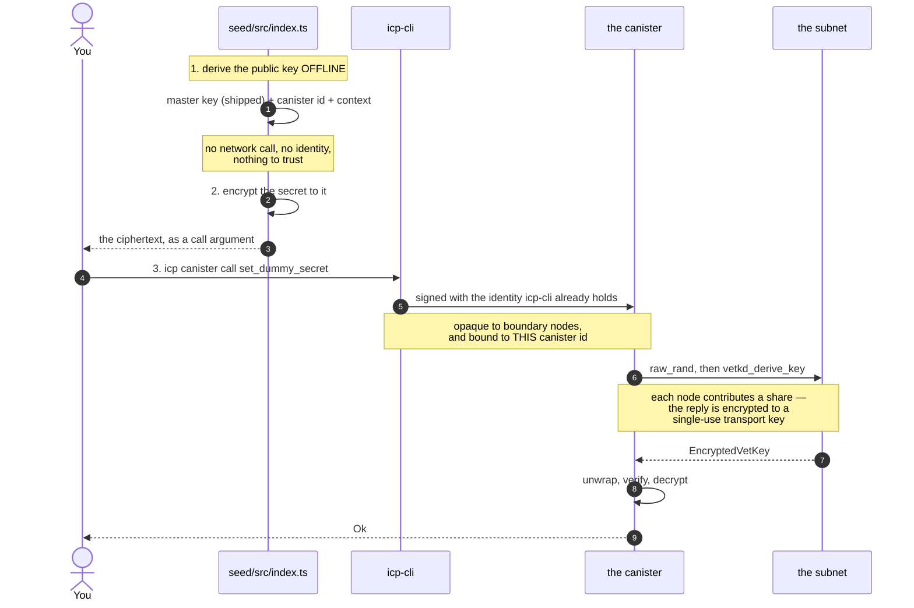

# Seeding a canister with a secret, via vetKeys

A minimal proof of concept: get an API key into a **deployed** canister without
the plaintext ever appearing in an ingress message, a manifest, a shell history,
or a CI log.

The client encrypts to a public key it derives **offline**, sends the ciphertext
in an ordinary update call, and only the target canister can recover the
plaintext.

```bash
# encrypt, offline — no identity needed
DUMMY_SECRET=hunter2 npm run seal -- --canister <id> --out arg.did
# send it, signed by the identity icp-cli already holds
icp canister call <canister> set_dummy_secret --args-file arg.did
```

Two endpoints, two implementations of them, and one script. Everything on the
path is meant to be read start to finish:

|                                                                |           |
| -------------------------------------------------------------- | --------- |
| [`rust/canister/src/lib.rs`](./rust/canister/src/lib.rs)       | 144 lines |
| [`motoko/canister/src/Main.mo`](./motoko/canister/src/Main.mo) | 160 lines |
| [`seed/src/index.ts`](./seed/src/index.ts)                     | 159 lines |

> A fuller version of this — a proposed standard interface, subnet preflight
> checks, rotation, key-diffing, an HTTPS-outcall example, and the reasoning
> behind each — lives on the
> [`standardization-proposal`](../../tree/standardization-proposal) branch. This
> branch is deliberately the bare mechanism.

## Why this needs vetKD

You want to hand a secret to one specific canister so only it can read it. That
is what public-key encryption is for — the recipient needs a public key you can
encrypt to, and a private key only they can use.

**A canister cannot just generate a keypair.** Its entire memory is replicated
across every node of its subnet, written to disk in checkpoints, and shipped to
new nodes during state sync. Even its randomness is not private: `raw_rand`
comes from the round's random tape, which every node sees. A canister has no
secrets from its own subnet's replicas, so it cannot generate a private key and
keep it.

**vetKD supplies the missing half.** The subnet collectively holds a master
secret, split across its nodes so no single node has it. From that:

- **anyone** can compute, offline, the _public_ key for a given (canister,
  context) pair — no network call, no permission;
- **only that canister** can ask the subnet to reconstruct the matching private
  key, via `vetkd_derive_key`, with each node contributing a share.

That is a real keypair for a canister, which is the thing that did not exist
before.

## The flow



Two things worth noticing. The client derives the key **itself**, from a master
public key shipped in the vetKeys library — it never asks the canister what to
encrypt to, because anyone able to tamper with that reply could hand it a key
they control.

And **the encrypting half needs no identity at all.** Deriving a public key and
encrypting to it are pure computation. Only the call needs a signature, and
icp-cli makes it with the identity it already holds — so nothing here asks you
to export a private key to a file.


## Try it

Needs [icp-cli](https://github.com/dfinity/icp-cli), a Rust toolchain with the
`wasm32-unknown-unknown` target, [mops](https://mops.one), and Node 22+.

```bash
./scripts/local-test.sh
```

That starts a local network, deploys both canisters, seals a secret into each,
reads it back, and checks it matches. To do it by hand:

```bash
icp network start local --background
icp deploy -e local --yes

CID=$(icp canister status dummy-secret-rust -e local --json | jq -r .id)

# encrypt — offline, and with no identity involved
DUMMY_SECRET=hunter2 npm --prefix seed run seal -- \
  --canister "$CID" --source pocketic --out /tmp/arg.did

# send it — icp-cli signs with the identity it already has
icp canister call dummy-secret-rust set_dummy_secret --args-file /tmp/arg.did -e local

icp canister call dummy-secret-rust get_dummy_secret '()' -e local
# (variant { Ok = opt "hunter2" })
```

For the Motoko canister, call `setDummySecret` and `getDummySecret` — each
follows its own language's naming convention.

### `--source` is not optional, and not guessable

Mainnet and a local network **both** have a key called `key_1`, backed by
different master keys — necessarily, since a local network cannot hold mainnet's
master secret. So a key _name_ does not identify a key. Choose the wrong table
and you get a ciphertext nobody can ever open, with no error until the canister
tries to decrypt it.

## About `get_dummy_secret`

**It exists only so you can watch decryption work, and a real canister must not
have it.** The reply is not encrypted end to end: the boundary node terminates
TLS and sits outside the subnet's trust boundary, so this hands the secret
straight back out — undoing, on the way out, exactly what sealing achieved on
the way in.

It is controller-gated, which is not much of a defence — a controller can
install code that reads the secret anyway — but it keeps the PoC from being an
open oracle while it is deployed.

To confirm the right secret is deployed _without_ an endpoint like this, seal
the value you expect and have the canister compare plaintexts, answering one
bit. The `standardization-proposal` branch does that.

## What this protects, and what it does not

**Protects:** the secret in transit. It never appears in an ingress message, a
Candid argument, shell history, or a CI log — and the ciphertext is bound to one
canister id, so replaying it elsewhere is useless.

**Does not protect:** the secret at rest, on its own. Once decrypted, the
plaintext is in the canister's memory, which is replicated state, checkpointed
to disk on every node, and shipped in state sync. On an ordinary subnet a node
operator can read it out of a checkpoint. **A SEV-SNP subnet is what changes
that** — guest memory encrypted under a key the hypervisor cannot access, plus a
data partition keyed to the launch measurement.

This PoC does not check whether it is on such a subnet. A real deployment must.

**Also does not protect against the controller.** They can install code that
decrypts the secret — vetKD binds the key to the _canister id_, not the module
hash — or read it out of a canister snapshot. For this use case that is usually
fine: the controller is whoever seeded the secret, and already knows it.

## Layout

```
rust/canister/         the Rust canister — the reference implementation
motoko/canister/       the same thing in Motoko
seed/src/index.ts      the seeding script
scripts/local-test.sh  the round trip, one command

motoko/bls12-381/      EXPERIMENTAL, UNAUDITED BLS12-381 for Motoko
motoko/vetkeys/        EXPERIMENTAL, UNAUDITED vetKD layer on it
rust/vectorgen/        generates the test vectors those two assert against
```

The two Motoko libraries exist because `mo:ic-vetkeys` has no BLS12-381, so
Motoko cannot decrypt a vetKey without them. **They are a proof of concept, not
reviewed by a cryptographer, and must not be used in production** — see
[motoko/README.md](./motoko/README.md). The Rust canister uses the audited
`ic-vetkeys` crate and needs none of this.

## Licence

Apache-2.0.
