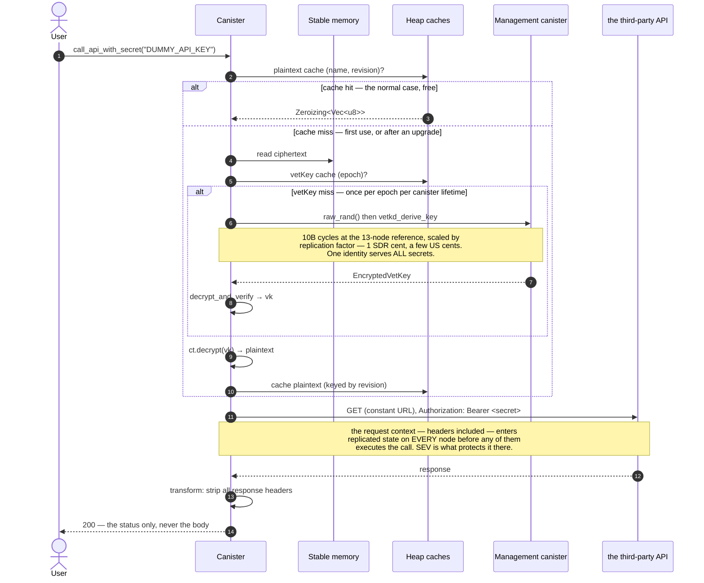

# Seeding a canister with secrets via vetKeys

A proof of concept for getting a secret — an API key, a token — into a **deployed**
canister without the plaintext ever appearing in an ingress message, a manifest, a
shell history, or a CI log.

The client encrypts the secret to a public key it derives **offline**, sends the
ciphertext in an ordinary update call, and only the target canister can recover the
plaintext. On a SEV-SNP subnet, memory encryption and a launch-measurement-keyed
data disk then protect the decrypted value from node operators.

This exists to be argued with. The interface is a starting proposal, not a standard.
For what productizing it would look like, see **[FOLLOW-UPS.md](./FOLLOW-UPS.md)**.

> **Do not deploy this as-is.** It ships a `secret_reveal` test hook (absent from a
> default build, but enabled by this repo's `icp.yaml`), and the whole guarantee is void
> unless the canister is blackholed or governed — see [Security model](#security-model).

---

## The problem this solves

icp-cli's current answer to "my canister needs an API key" is a plaintext canister
setting:

```yaml
settings:
  environment_variables:
    API_KEY: { path: ./secrets/api-key }   # sent in the clear via update_settings
```

That value travels in an ingress message and lands in replicated state unencrypted.
This repo is the encrypted equivalent.

## Why it needs vetKD

To send a secret to someone you encrypt to their public key, and they decrypt with
their private key. **A canister has no private key and cannot make one:** its whole
memory is replicated across every node of its subnet, checkpointed to disk, and
shipped to new nodes during state sync. Even its randomness is not private —
`raw_rand` derives from the round's random tape, a threshold signature every node
sees. A canister fundamentally has no secrets from its own subnet's replicas.

vetKD supplies the missing piece. The subnet *collectively* holds a master secret,
split across nodes so no single node has it. From that:

- **anyone** can compute, offline, the public key belonging to a given
  (canister, context) pair, starting from a published master public key; and
- **only that canister** can ask the subnet to reconstruct the matching private key,
  via `vetkd_derive_key`.

That is a real asymmetric keypair for a canister. "Identity-based" means the public
key is *derived from a name* — the canister id plus a context string — rather than
being a random blob someone had to generate and distribute. That is why step 1 below
is arithmetic you can do on a laptop before the canister has executed a single
instruction.

**Is IBE required?** You need some public-key encryption where the canister holds the
private half, and vetKD is the only mechanism on the IC that gives a canister a
private key at all. Threshold ECDSA and Schnorr produce *signing* keys, and the
management canister exposes no decryption operation for them, so they cannot receive
a secret. Given vetKD, IBE is both the natural fit and the one already implemented
and reviewed on both sides by `ic-vetkeys`.

## The flow

```mermaid
sequenceDiagram
    autonumber
    actor Dev as Developer / CI
    participant Script as Seeding script (host)
    participant Reg as Registry canister
    participant Can as Target canister
    participant Mgmt as Management canister<br/>(own subnet)

    Dev->>Script: DUMMY_API_KEY=… npm run seal

    rect rgba(120,120,120,.12)
    note over Script,Reg: Preflight — two properties, both required, neither implies the other
    Script->>Reg: get_subnet_for_canister(cid)
    Reg-->>Script: subnet_id
    Script->>Reg: get_subnet(subnet_id)
    Reg-->>Script: SubnetRecord { features.sev_enabled, chain_key_config }
    Script->>Script: assert sev_enabled == true
    Script->>Script: assert the vetKD key is present
    end

    rect rgba(120,120,120,.12)
    note over Script: Offline — pure arithmetic, zero network calls
    Script->>Script: mpk = MasterPublicKey.productionKey(key_1)
    Script->>Script: dpk = mpk.deriveCanisterKey(cid).deriveSubKey(CONTEXT)
    end

    Script->>Can: icp_sealed_secret_info()  [query]
    Can-->>Script: { public_key, context, identity, epoch }
    Script->>Script: assert public_key == dpk — else ABORT

    Script->>Script: ct = IbeCiphertext.encrypt(dpk, identity, secret, random seed)
    Script->>Can: icp_sealed_secret_set("DUMMY_API_KEY", ct)

    rect rgba(120,120,120,.12)
    note over Can,Mgmt: set is async and trial-decrypts — a wrong key fails HERE, not in production
    Can->>Can: is_controller(caller)? ; IbeCiphertext::deserialize(ct)
    Can->>Mgmt: raw_rand()
    Mgmt-->>Can: 32 bytes
    Can->>Can: tsk = TransportSecretKey::from_seed(seed)
    Can->>Mgmt: vetkd_derive_key { context, identity, key_id, tsk.public_key() }
    Mgmt-->>Can: EncryptedVetKey (192 B)
    Can->>Can: dpk' = compiled-in master key → derive_canister_key(self) → derive_sub_key(CONTEXT)
    Can->>Can: vk = EncryptedVetKey.decrypt_and_verify(tsk, dpk', identity)
    Can->>Can: trial ct.decrypt(vk) — else Err(InvalidCiphertext)
    Can->>Can: store ct in STABLE memory ; cache vk + plaintext in heap
    end

    Can-->>Script: Ok(revision)
    Script-->>Dev: ✓ Sealed DUMMY_API_KEY
```

Later, whenever the secret is used, the canister decrypts from the stored ciphertext
and caches the plaintext in the heap. After an upgrade it repeats one
`vetkd_derive_key` and carries on — **you never re-seed**.



**Cost.** `VETKD_FEE` is 10B cycles at the 13-node reference subnet, scaled by
replication factor (`ic/rs/config/src/subnet_config.rs:130`), and the comment there puts
10B cycles at **1 SDR cent** — a few US cents on a 34-node subnet. It is paid once per
canister lifetime plus once after each upgrade, *not* per secret, because one identity
serves them all. That is why cost is no reason to deviate from IBE.

### Using the secret — the point of all this

Sealing a secret is only useful if the canister can *use* it. The canonical case is an
authenticated HTTPS outcall, and `call_api_with_secret` in
[`crates/canister/src/lib.rs`](./crates/canister/src/lib.rs) is a working one.
`local-test.sh` step 10 asserts **both** branches:

```
== 10. the actual use case: an authenticated HTTPS outcall
  ok — the call SUCCEEDS with the sealed credential (200)
  ok — and FAILS with a wrong one (401): the value is what authenticated
```

```rust
let plaintext = keys::open(&name, &record).await?;      // decrypt (cached)
let token = core::str::from_utf8(plaintext.as_slice())?;

let request = HttpRequestArgs {
    url: DEMO_API_ENDPOINT.to_string(),                 // a CONSTANT — see below
    method: HttpMethod::GET,
    headers: vec![
        HttpHeader { name: "Authorization".into(),    value: token.to_string() },
        HttpHeader { name: "Idempotency-Key".into(),  value: idempotency_key },
        HttpHeader { name: "User-Agent".into(),       value: "…".into() },
    ],
    max_response_bytes: Some(2_048),
    transform: Some(transform_context_from_query("strip_response".into(), vec![])),
    ..Default::default()
};

let response = http_request(&request).await?;
u16::try_from(response.status.0)                        // ONLY the status
```

Four things in there are not stylistic.

**The URL is a constant, not a parameter.** `call_api(url, name)` would be an exfiltration
primitive — point it at a server you control and the secret is yours. A controller could
do that anyway by installing code, but shipping the capability as an endpoint is
gratuitous, and real canisters call a known API.

**Only the status code is returned.** Plenty of endpoints echo request headers —
`/headers`, `/anything`, most debug routes — so returning the body risks handing your own
`Authorization` header back to the caller, undoing the sealing completely.

**The transform is mandatory.** Every node performs the call independently and consensus
requires byte-identical responses, so per-node variation (`Date`, request ids, cookies)
has to be stripped or the call simply fails. Stripping headers also stops a hostile
endpoint reflecting the secret into replicated state.

**The idempotency key is mandatory for anything that mutates**, and for a reason specific
to ICP: that same fan-out means one logical outcall becomes **N real HTTP requests**, one
per node. A `GET` does not care. A `POST` that charges a card, sends an email or creates a
resource would happen N times unless the API deduplicates — so any non-idempotent call
needs a key the provider honours.

The key is a *parameter*, for the same reason Stripe makes it one: only the caller knows
whether this is a retry of one logical operation or a new one. Generating it inside would
make every retry a fresh operation, which is exactly the bug the header prevents. It needs
no special derivation — the request is built once during replicated execution and every
node sends those same bytes, so the value is already identical across the fan-out.

#### Why postman-echo, and why a public credential is fine here

The demo calls `https://postman-echo.com/basic-auth`, which accepts the documented
`postman:password` and rejects anything else. That distinction matters: an endpoint that
*ignores* `Authorization` — a status or health route — answers `200` whatever the canister
sends, which would demonstrate the plumbing while proving nothing about the secret.

Using a **published** credential is right for a demo and wrong for production, and the
difference is worth being precise about. A published credential proves nothing about
*secrecy*. But it is ideal for proving the *mechanism*, because the test can seal the
correct value and see `200`, then seal a wrong one and see `401`, with no setup and no real
key anywhere in the repo. Point the constant at your own API for anything real.

The sealed secret is the **complete `Authorization` header value**, not just a token, so
the same code works for `Bearer ghp_…`, `Basic dXNlcjpwYXNz`, or whatever scheme an API
expects.

And the exposure this creates, spelled out under [HTTPS outcalls](#https-outcalls): the
request context, headers included, enters replicated state on **every** node before any of
them executes the call. On a SEV-SNP subnet that is encrypted memory and measurement-keyed
disk; on any other subnet the secret is readable by every node operator the moment this
runs.

### Three decisions worth understanding

**The client computes the public key; it does not trust the one it is told.** If a
client asked the canister and believed the answer, anyone able to tamper with that
response could substitute a key they control and harvest the secret — and unlike the
canister's inter-canister calls, this response really does cross boundary nodes. So the
client derives the key from a master-key constant it ships with, uses
`icp_sealed_secret_info` purely as a cross-check, and aborts on mismatch.

The canister takes its own key from `vetkd_public_key`, which is authoritative for the
subnet it is on. Verifying against that is circular, but cheaply so: a subnet that would
lie about its public key already holds the master key and could decrypt everything
anyway. The non-circular audit lives in `self_test`, on demand.

**`set` is async and trial-decrypts before storing.** A wrong context, epoch or key
name otherwise produces a perfectly-accepted ciphertext that nobody discovers is
unreadable until a production call months later. Paying one key derivation at seal
time turns that into an error in front of the operator.

**One identity serves every secret.** A single `vetkd_derive_key` unlocks all of them.
Per-secret identities would multiply the cost by N and buy nothing: there is no
privilege boundary inside a canister, since its code can derive the key for any
identity whenever it likes.

## Quick start

Requires Rust with the `wasm32-unknown-unknown` target, Node 22+,
[icp-cli](https://github.com/dfinity/icp-cli), and `candid-extractor`
(`cargo install candid-extractor`).

**In one command:** `./scripts/local-test.sh` — see [Testing locally](#testing-locally).

Step by step:

```bash
# 1. local network (this project uses port 8010 to avoid clashing with others)
icp network start local --background
icp deploy -e local

# 2. an identity the canister will accept as a controller
icp identity export "$(icp identity default)" > /tmp/seed-id.pem
export SEAL_IDENTITY_PEM=/tmp/seed-id.pem

# 3. seal a secret — read from the environment, never from argv
cd seed && npm install
export DUMMY_API_KEY='sk-example-not-a-real-key'

CID=$(icp canister status sealed-secrets -e local --json | jq -r .id)

npm run seal -- \
  --canister "$CID" \
  --name DUMMY_API_KEY \
  --host http://127.0.0.1:8010 \
  --source pocketic \
  --local          # see "Local vs mainnet" below for what this waives
```

```
preflight
  subnet:   w5bul-v73ez-…-7ae
  sev-snp:  NOT REPORTED — expected on a local network, where SEV cannot be simulated
  vetkd:    "key_1" NOT on this subnet — subnet holds no vetKD keys
            On mainnet this is fatal: vetkd_derive_key is served by the
            calling canister's own subnet. PocketIC does not enforce that,
            so a local run will succeed anyway and hide the problem.

key derivation
  source    pocketic:key_1
  context   01156963702d7365616c65642d736563726574732d763100
  identity  01156963702d7365616c65642d736563726574732d763100000000  (epoch 0)
  derived   a0d33e4e648337dafede99ae71fdc17a…
  verified  canister agrees with our offline derivation

sealing "DUMMY_API_KEY" (25 bytes → 161 bytes)
✓ sealed "DUMMY_API_KEY" at revision 0
  the canister trial-decrypted it before storing, so it is readable
```

Confirm the canister holds the value you expect — the production-safe check, which
discloses nothing in either direction:

```bash
DUMMY_API_KEY='sk-example-not-a-real-key' npm run seal -- \
  --canister "$CID" --name DUMMY_API_KEY --host http://127.0.0.1:8010 \
  --source pocketic --local --verify
# ✓ the canister already holds this value for "DUMMY_API_KEY"
```

Then, if you want to watch the round trip rather than trust it, and check the whole
derivation path is healthy:

```bash
icp canister call sealed-secrets secret_reveal '("DUMMY_API_KEY")' -e local
icp canister call sealed-secrets icp_sealed_secret_self_test '(opt variant { PocketIc })' -e local
```

`self_test` takes the network you *believe* you are on and reports
`public_key_matches_master = opt true` when the subnet's own `vetkd_public_key` agrees
with the master key compiled into the Wasm. That is the one check in the design that is
not the subnet vouching for itself — pass `variant { Mainnet }` there and it correctly
returns `opt false`. Pass `null` to skip the audit.

### On mainnet

Drop `--local` and switch the master-key table:

```bash
npm run seal -- --canister <id> --name DUMMY_API_KEY \
  --host https://icp-api.io --source mainnet
```

The preflight then hard-fails unless the subnet reports `sev_enabled` **and** holds
the vetKD key. Both are real checks on mainnet; neither can be rehearsed locally.

> `--source` is not inferable from the key name. Mainnet and PocketIC each have a key
> called `key_1`, backed by **different** master public keys. Choosing wrong yields
> ciphertext nobody can ever decrypt — which is why the client verifies against the
> canister before encrypting, and why `crates/core/tests/golden.rs` asserts the two
> derivations differ. `ic-vetkeys`' own `management_canister::compute_vrf` has exactly
> this bug today.

## Testing locally

One command does the whole round trip:

```bash
./scripts/local-test.sh
```

It starts a local network, deploys, seals a secret, **reads it back in the clear**, and
checks it survives an upgrade — then runs the negative cases. It also asserts two things
that are easy to let rot: that a build *without* `--features test-hooks` exposes no
endpoint that can observe a secret, and that the generated TypeScript bindings still
match the canister's `.did`.

Individually:

```bash
cargo test          # golden vectors, name validation, key derivation
cd seed && npm test # the SAME golden vectors, in TypeScript

# against a running canister; needs a controller identity
icp identity export "$(icp identity default)" > /tmp/id.pem
cd seed && SEAL_IDENTITY_PEM=/tmp/id.pem npm run e2e -- \
  --canister <id> --host http://127.0.0.1:8010 --source pocketic
```

The Rust and TypeScript golden vectors are byte-for-byte identical on purpose: the two
implementations cannot drift without one suite failing. A future Motoko port should
assert the same values.

The e2e suite covers the cases that matter — ciphertext sealed to the wrong epoch,
malformed blobs, oversized input, invalid names, anonymous callers, that rejected writes
leave no trace, and that overwriting does not serve a stale cached plaintext.

### Confirming the right secret is deployed

The question an operator actually has is *"is the value I hold the one in the canister?"*
— and they already know the value, so they need one bit back, not the secret.

```bash
DUMMY_API_KEY='the-value-i-expect' npm run seal -- \
  --canister <id> --name DUMMY_API_KEY --verify --source mainnet
```

```
✓ the canister already holds this value for "DUMMY_API_KEY"
```

Exit status is 0 on a match and 1 on a mismatch, so it scripts. Under the hood this is
`icp_sealed_secret_matches`: the client seals its candidate with a fresh IBE seed exactly
as it would for `set`, and the canister decrypts both and compares in constant time.

This is deliberately **not** a "return me a digest of the plaintext" endpoint:

- a digest of a low-entropy secret is brute-forceable offline by anyone who sees it, and
  replies cross a boundary node in the clear;
- sending `sha256(expected)` in the *request* would put the same brute-forceable digest on
  the wire;
- a ciphertext discloses nothing in either direction, and a boolean tells the caller
  everything a digest would.

It is controller-gated, because for anyone else it is an oracle for confirming guesses.
For a controller it discloses nothing new — they can already read the secret by installing
code that decrypts it.

**This is safe in production and is the intended verification path.**

### Seeing the plaintext

`matches` proves the right value is there. If you additionally want to *look* at it —
which is the whole point of a PoC someone is deciding whether to trust — build with
`--features test-hooks` (which `icp.yaml` does) and call `secret_reveal`.
`local-test.sh` step 8 prints both the sealed and the revealed value.

That feature exists for exactly one reason: convincing a human. Nothing automated needs it.
A successful `set` already proves the canister could decrypt, since `set` trial-decrypts
before storing, and `matches` covers verification. **A generalized implementation would
ship no such endpoint at all**, and neither should any real deployment — see
[Can I just add a getter?](#can-i-just-add-a-getter).

**The hook is genuinely absent from a default build, not merely hidden.** A canister
method is a wasm export, so this is checkable four ways, and all four agree:

| Check | Default build | `--features test-hooks` |
|---|---|---|
| Candid interface (`candid-extractor`) | absent | present |
| Wasm export section | no `canister_update secret_reveal` | present |
| Byte scan of the whole binary | **0** occurrences of the string | present |
| Calling it on a deployed canister | rejected, `IC0536 Canister has no update method 'secret_reveal'` | returns the value |

`local-test.sh` and CI assert the byte scan on every run, with a control (that
`icp_sealed_secret_set` *is* present) so the check cannot pass by reading the wrong file.

### Can I just add a getter?

Not in production — but the reason is more interesting than "it would leak the key",
because **a controller can obtain the secret anyway**. Two routes, no endpoint required:

1. **Install code that decrypts.** vetKD binds the key to the **canister ID**, not to the
   module hash — `vetkd_public_key` takes `{ canister_id, context, key_id }` and nothing
   about the code. The ciphertext sits in stable memory and survives an upgrade, so any
   module a controller installs on that canister can derive the same key. There is no way
   to pin a sealed secret to a particular code version.
2. **Read the heap out of a snapshot.** `take_canister_snapshot`, then
   `read_canister_snapshot_data` with `kind = variant { wasm_memory : record { offset; size } }`.
   The decrypted plaintext cache is right there.

So what does a getter actually cost you?

- **It ships the plaintext to a boundary node.** Replies are not encrypted end-to-end; the
  boundary node terminates TLS and sits *outside* the subnet's SEV-SNP trust boundary. That
  undoes in the outbound direction exactly what sealing achieved on the way in. (Note a
  `query` is the *less* bad choice here — an `update` reply is written into replicated state
  on every node, whereas a query reply is ephemeral.)
- **It destroys the property that makes the code auditable.** "The published code never
  returns the plaintext" is something a reader can verify by reading it. Replace it with
  "…unless the caller is a controller" and the guarantee now rests on the controller set
  being, and remaining, exactly what you believe.
- **It leaves no trace.** Installing leaky code changes the module hash, which is visible
  in the state tree. A call to a getter leaves nothing behind.

The corollary is the one that matters for deployment: **since a controller can always get
the secret, the canister must be blackholed or SNS/NNS-governed for any of this to mean
anything.** On a blackholed canister a controller-gated getter is inert — nobody is a
controller — but by then you have no way to observe the secret anyway, which is the point.

None of this argues against `icp_sealed_secret_matches`: it returns one bit about a value
the caller already holds, not the value itself, so it survives every objection above.

## Client bindings

`seed/src/declarations/` is **generated** from `crates/canister/sealed_secrets_canister.did`
by [`@icp-sdk/bindgen`](https://www.npmjs.com/package/@icp-sdk/bindgen):

```bash
cd seed && npm run bindings
```

Regenerate whenever the canister interface changes; `local-test.sh` fails if you forget.

Only the NNS registry interface in `seed/src/idl.ts` is hand-written, because there is no
`.did` for it here and we need two of its ~20 methods. An earlier revision hand-wrote the
canister interface too, and it silently drifted twice. Generating it also turned two
latent bugs in the e2e suite into compile errors, because the generated result types are
proper discriminated unions rather than `any`.

## Wire format

```
context  := 0x01 || u8(len(SUITE)) || SUITE || u8(len(app_separator)) || app_separator
identity := 0x01 || u8(len(SUITE)) || SUITE || be_u32(epoch)
SUITE     = "icp-sealed-secrets-v1"
```

Both variable-length fields are length-prefixed so no two distinct inputs can encode
identically. The application domain separator is **always empty** in this PoC — it
exists so a canister that later needs vetKD for several purposes can adopt one without
a format break, and is not exposed as configuration. Golden values:

| Value | Bytes |
|---|---|
| `context("")` | `01156963702d7365616c65642d736563726574732d763100` |
| `context("demo")` | `01156963702d7365616c65642d736563726574732d76310464656d6f` |
| `identity(0)` | `01156963702d7365616c65642d736563726574732d763100000000` |

Secret names are `[A-Za-z0-9_.-]{1,64}` — matching environment-variable conventions,
and sidestepping the Unicode confusables an arbitrary Candid `text` would admit.

## Interface

```candid
icp_sealed_secret_info      : ()               -> (variant { Ok : SealedSecretInfo; Err : SealedSecretsError });
icp_sealed_secret_set       : (text, blob)     -> (variant { Ok : nat64; Err : SealedSecretsError });
icp_sealed_secret_matches   : (text, blob)     -> (variant { Ok : bool;  Err : SealedSecretsError });
icp_sealed_secret_unset     : (text)           -> (variant { Ok; Err : SealedSecretsError });
icp_sealed_secret_list      : ()               -> (variant { Ok : vec SealedSecretEntry; Err : … }) query;
icp_sealed_secret_self_test : (opt KeySource)  -> (variant { Ok : SelfTestReport; Err : … });

// not part of the proposed standard — the worked example of USING a secret
call_api_with_secret        : (text, text)     -> (variant { Ok : nat16; Err : SealedSecretsError });
strip_response              : (TransformArgs)  -> (HttpRequestResult) query;
```

Install args are just `(record { key_name : text })`.

Only the first two are load-bearing for a tool that seals: `info` says what to encrypt to,
`set` receives it. `matches` is what an operator uses to confirm the right value is
deployed. `list`, `unset` and `self_test` are convenience, and a generalized version should
treat them as optional — see [FOLLOW-UPS.md](./FOLLOW-UPS.md).

- **`info` is an update**, because `public_key` comes from `vetkd_public_key` —
  authoritative for whichever subnet the canister is actually on. It is cached, so only
  the first call pays. Earlier drafts derived it from a compiled-in master key so `info`
  could be a query, but that meant an install-time `key_source` argument that silently
  orphaned every ciphertext if set wrong. Asking the subnet means one build runs
  anywhere with nothing to configure, and it makes the client's comparison *stronger*:
  the canister now reports what the subnet says, and the client checks it against an
  independent constant, rather than the two agreeing because they share a constant.
- **Errors are a typed variant**, so tooling can branch on `VetKdUnavailable` versus
  `InvalidCiphertext` rather than parsing prose.
- **`list` is controller-gated.** It looks harmless but is not: IBE overhead is a fixed
  136 bytes, so `ciphertext_len` reveals the exact plaintext length, and names alone
  are useful reconnaissance.
- **Nothing derived from a plaintext is ever exposed.** A digest of the plaintext would
  be an offline guessing oracle for low-entropy secrets; `ciphertext_sha256` is a
  digest of a *randomised* ciphertext, so it reveals nothing while still letting a
  client confirm its upload landed.
- **There is no `get` in a default build.** No endpoint returns a plaintext. The
  `test-hooks` feature adds `secret_reveal`, which does — see
  [Seeing the plaintext](#seeing-the-plaintext) and
  [Can I just add a getter?](#can-i-just-add-a-getter).
- **`call_api_with_secret` and `strip_response` are not part of the proposed standard.**
  They are the worked example of *using* a sealed secret — see
  [Using the secret](#using-the-secret--the-point-of-all-this). A real canister writes its
  own equivalent; nothing in the standard prescribes how the secret gets used.
- **A successful `set` already proves the canister can decrypt**, because it trial-decrypts
  before storing. Tooling therefore never needs a read-back endpoint to confirm a seal
  worked, and `matches` covers "is it still the right value?" — which is the same design
  decision as "there is no `get`", seen from the other side.

## Security model

**What sealing gives you.** The secret is encrypted to a key derivable only by this
canister on this subnet. It never appears in an ingress message, a Candid argument, a
shell history, a CI log, or the canister's interface. The ciphertext is bound to the
canister id, so replaying it elsewhere is useless.

**What it does not.** Once decrypted, the plaintext is in the Wasm heap — which is
replicated state, checkpointed to disk on every node, and shipped in state sync.
Keeping it out of `StableBTreeMap` does **not** keep it off disk. On a non-TEE subnet
a node operator reads it out of a checkpoint.

**What SEV-SNP adds — load-bearing, not a bonus.** Guest memory encrypted under a key
the hypervisor cannot access, plus a LUKS data partition keyed to the SEV launch
measurement. This is the *only* thing that moves "node operators can read the
plaintext" to "cannot". **Without a SEV-SNP subnet this scheme protects the secret in
transit and at rest in the ingress history, and nothing more.**

### What is still exposed

- **Controllers.** A controller can `install_code` with code that returns the
  plaintext, *or* take a snapshot and `read_canister_snapshot_data` the Wasm memory
  directly — no upgrade required. **Public source is necessary and nowhere near
  sufficient.** The canister must be blackholed or SNS/NNS-governed, with a
  reproducible build, a verified module hash, and a verified controller set.
- **The canister's own code.** vetKD hands it the key on demand. The guarantee is
  exactly "the published, verified code does not expose the plaintext".
- **Any non-SEV node in the subnet.** Replicated state is on all of them, so the
  protection is only as strong as the weakest node.
- **Attestation.** Nothing here proves the subnet is SEV-SNP. Verify out of band.

### HTTPS outcalls

Using a secret in an outcall header does **not** widen the trust boundary beyond what
decryption already crossed, but it is worth knowing exactly where the bytes go:

| Where the plaintext is | Protected on a SEV subnet? |
|---|---|
| `CanisterHttpRequestContext { url, headers, body }` in replicated state, on every node, checkpointed | ✅ memory encryption + measurement-keyed LUKS |
| The request built by `ic-https-outcalls-adapter` | ✅ it is a GuestOS service, inside the SEV guest |
| On the wire to the endpoint | ✅ TLS, terminated by the adapter |
| Through a SOCKS proxy on another node | ✅ the proxy sees ciphertext only — TLS wraps the tunnel |

**A trap:** `flexible_http_request` lets a canister set `replication.total_requests`
as low as 1. That reduces how many nodes open a connection, but **not** how many hold
the header bytes — the request context enters replicated state before any node
executes it. It is an egress knob, not a confidentiality control.

Still leaked even on SEV, because it is outside the encrypted payload: the destination
host (TLS SNI, DNS), timing, and request/response sizes. The key itself is not.

## Do not lose the canister ID

vetKD derives the key from the **canister ID**. That is what makes a ciphertext decryptable
by exactly one canister — and it is also a durability requirement most projects do not have.

icp-cli records mainnet canister IDs in `.icp/data/mappings/<environment>.ids.json`, and
that directory is **deliberately not gitignored** here. Losing it is not the usual
inconvenience of having to look an ID up on the dashboard: if it leads to deploying a
*replacement* canister, every secret ever sealed to the old one becomes permanently
unreadable, because the key derived from the old ID cannot be derived by the new canister.

Commit `.icp/data/`. Only `.icp/cache/` is disposable.

The same reasoning applies to canister migration: moving a canister to another subnet
changes nothing (the ID travels with it), but re-creating one does.

## Prerequisites for a real deployment

Two **independent** subnet properties — neither implies the other:

1. **The subnet holds the vetKD key** (an NI-DKG transcript for `bls12_381_g2:key_1`
   reshared to it). A SEV-SNP subnet is not automatically a vetKD subnet, and without
   the key every `vetkd_derive_key` is rejected.
2. **The subnet's nodes are SEV-SNP.**

The seeding script checks both from a single registry `get_subnet` query and refuses to
seal unless both hold, with a separate override per check because they fail for very
different reasons — see below.

### Local vs mainnet — what a local run does and does not prove

`icp network start` always creates NNS, **fiduciary**, **TestThresholdKeys** and
application subnets. PocketIC attaches vetKD keys only to the **II and fiduciary**
subnets (`pocket_ic.rs`: `if subnet_kind == II || Fiduciary` → `key_1`, `test_key_1`,
`dfx_test_key`), which is where local `key_1` comes from.

| | Local / PocketIC | Mainnet |
|---|---|---|
| **Registry reports the subnet's vetKD keys** | ✅ **accurate** — fiduciary shows `key_1`, application shows none | ✅ accurate |
| **Placement enforced when deriving** | ❌ **not enforced** — a canister on a keyless subnet derives happily | ✅ rejected: `Subnet {id} does not hold NiDkgTranscript for key {key_id}` |
| **`features.sev_enabled`** | ❌ always `null` — SEV cannot be simulated | ✅ reported |

Two consequences, and they point in opposite directions.

**The vetKD check works locally, and you should not skip it.** The registry tells the
truth: deploy this PoC and it lands on the *application* subnet, and the preflight
correctly reports `"key_1" NOT on this subnet`. It is right — and mainnet would reject
every derive. But PocketIC does not enforce placement (verified: our canister id
`7fffffffffa00002…` falls in the application range, and derivation succeeded anyway),
so **the local runtime hides the very mistake the preflight caught**. That is why
`--allow-missing-vetkd-key` is a sharper knife than it looks, and why it is a separate
flag rather than folded into one blanket override.

PocketIC does check that the key exists *somewhere* in the instance — install with a
key name no subnet has and `self_test` reports `vetkd_public_key_ok = false` — but that
is a weaker check than mainnet's.

**SEV cannot be exercised locally at all.** `sev_enabled` is `null` for every local
subnet, so `--allow-unverified-sev` is unavoidable locally and says nothing about your
deployment. On mainnet it is the check that carries the entire security argument: without
a SEV-SNP subnet, node operators can read the plaintext out of a checkpoint the moment
the canister decrypts it, and this scheme protects the secret only in transit and in the
ingress history.

**So the mainnet checklist is not optional and cannot be rehearsed locally:**

1. Place the canister on a subnet that actually holds `key_1` — on mainnet, a fiduciary
   subnet. Confirm from the registry *before* deploying.
2. Confirm that subnet reports `sev_enabled = true`.
3. Run `icp_sealed_secret_self_test(opt variant { Mainnet })` immediately after install
   and check `public_key_matches_master = opt true`.

## Layout

```
crates/core/           wire format + offline key derivation. No canister APIs; host-testable.
crates/core/tests/     golden vectors — the contract other implementations must meet.
crates/canister/       the canister: endpoints, stable store, key derivation and caches.
seed/src/              the host-side seeding script and the e2e suite.
seed/src/declarations/ GENERATED from the .did — do not edit; `npm run bindings`.
scripts/local-test.sh  the whole round trip, one command.
icp.yaml               local (port 8010) and ic environments.
.github/workflows/     CI on ghcr.io/dfinity/icp-dev-env-all.
.icp/cache/            gitignored — recreatable.
.icp/data/             appears after a mainnet deploy. NOT gitignored — commit it.
```

The core/canister split is deliberate. It keeps the format layer free of `ic-cdk` and
`ic-stable-structures`, which is the shape a library version would need — see
[FOLLOW-UPS.md](./FOLLOW-UPS.md).

## Deliberately out of scope

Rotation, using `matches` to make `icp deploy` idempotent, the macros that would make this
three lines in someone else's canister, splitting `ic-vetkeys` itself along a Cargo
feature, and any icp-cli integration. All of it is discussed in
**[FOLLOW-UPS.md](./FOLLOW-UPS.md)**; none of it belongs in something whose job is to start
a design conversation.

## Licence

Apache-2.0.
