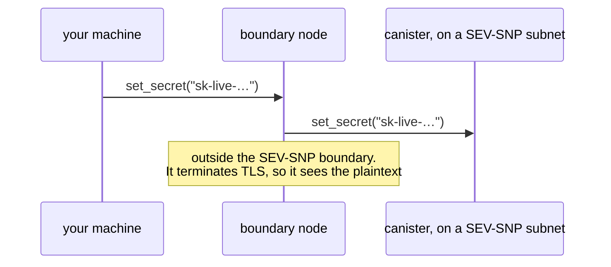
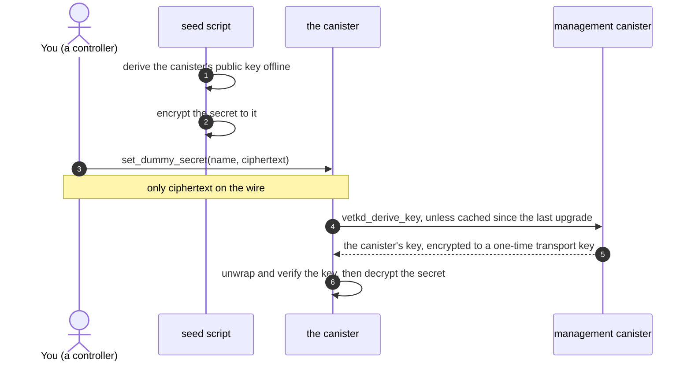

# Seeding a canister with secrets, via vetKeys

A minimal proof of concept for getting a secret — an API key, a token, a private
key — into a canister on a **SEV-SNP subnet** without it ever travelling in
plaintext.

## The problem

The goal is a canister that holds a secret and uses it, say as the credential on
the HTTPS outcalls it makes, without anyone else ever seeing it. On a SEV-SNP
subnet the canister's memory is encrypted, so node operators cannot read what it
holds. That makes it a sound place to _keep_ a secret.

The weak point is getting it there. The obvious call leaks it on the way:

```bash
icp canister call my-canister set_secret '("sk-live-…")'   # don't
```



The same plaintext also sits in the call's arguments, and from there in shell
history and CI logs. **So the secret must never be sent in plaintext.** It has to
be encrypted before it leaves your machine, to a key that only the target canister
can use.

## Why vetKD

That needs a keypair for the canister: a public key you can encrypt to, and a
private key only the canister can use. vetKD provides exactly that.

- **Anyone** can compute a canister's public key **offline**, from a published
  master public key, the canister id and a context. No network call, and nothing
  to trust beyond the master public key the client ships.
- **Only that canister** can obtain the matching private key, by calling
  `vetkd_derive_key`. The derivation takes the caller's canister id as an input,
  so no other canister can ask for it.

So everything on the way sees only ciphertext, and it is useless to anyone but
the one canister it was sealed to. As always with vetKD, that holds as long as
fewer than a threshold of the key-holding subnet's nodes collude.

### Couldn't the canister just generate a keypair?

It could. `raw_rand` cannot be read from outside the subnet, and a key made from it
would sit in the same SEV-SNP-protected memory as the secrets themselves, so
confidentiality is not what decides it. The trade-offs are:

| | vetKD | a key the canister generates |
|---|---|---|
| getting the public key | the client computes it offline | the client fetches it from the running canister, as a certified reply |
| sealing before the canister has run | yes, the id is enough | no: deploy, run, fetch first |
| after a reinstall | the same key, so earlier ciphertexts stay readable | a new key, so earlier ciphertexts are unreadable |
| where the key lives | derived when needed, never stored | in canister memory, which must be kept |
| what it rests on | a threshold of the key-holding subnet's nodes | the canister's own subnet |
| cost | 26 billion cycles per derivation, then cached | none |

For one credential in a canister you control, that is a close call. vetKD wins once
you want to seal before deploying, or need ciphertexts to outlive a reinstall.

## How it works



Encrypting needs no identity, so anyone can seal a secret _to_ the canister, but
only it can open one. Sending the call is the one step that needs a signature,
from a controller.

```candid
// name is a map key in the canister; it plays no part in any key derivation
set_dummy_secret : (name : text, ciphertext : blob) -> (variant { Ok; Err : text });
get_dummy_secret : (name : text) -> (variant { Ok : opt text; Err : text }) query;
```

`get_dummy_secret` exists only so you can see that decryption worked. It sends
the plaintext back out through a boundary node, undoing what sealing achieved,
so **a real canister must not have it**.

| | |
|---|---|
| [`seed/src/index.ts`](./seed/src/index.ts) | the client: derives the public key offline and encrypts to it |
| [`rust/canister/src/lib.rs`](./rust/canister/src/lib.rs) | the canister: has its key derived, decrypts, stores the plaintext |
| [`motoko/canister/src/Main.mo`](./motoko/canister/src/Main.mo) | the same in Motoko, as `setDummySecret` / `getDummySecret` |

Each is short enough to read start to finish.

## Try it

Needs [icp-cli](https://github.com/dfinity/icp-cli), a Rust toolchain with the
`wasm32-unknown-unknown` target, `candid-extractor` and `ic-wasm`,
[mops](https://mops.one), and Node 20.19+.

```bash
./scripts/local-test.sh
```

That starts a local network, deploys both canisters, seals two secrets into
each, reads them back and checks they match. By hand:

```bash
icp network start local --background
icp deploy -e local --yes

DUMMY_SECRET=super-secret-value ./scripts/seal.sh dummy-secret-rust exchange-rate-api-key
icp canister call dummy-secret-rust get_dummy_secret '("exchange-rate-api-key")' -e local
# (variant { Ok = opt "super-secret-value" })
```

`seal.sh` encrypts offline, then sends the call. Pass `ic` as a third argument to
target mainnet. That also switches the master-key table, which must match the
network: mainnet and a local network both have a `key_1`, backed by different
master keys, and encrypting to the wrong one gives a ciphertext nobody can open.
Encrypting by hand, that is `npm --prefix seed run seal -- --source mainnet …`.

The examples set `DUMMY_SECRET` inline for brevity. For a real secret, take it from
a secret store, so it stays out of your shell history too.

## What this PoC does not do

- **Check that the subnet is SEV-SNP.** Without SEV-SNP, node operators can read
  the secret once the canister has decrypted it. A real deployment must check.
- **Protect against the controller.** A controller can install code that reads
  the secret, since vetKD binds the key to the canister id and not to its code, or
  read it out of a canister snapshot.

The [`standardization-proposal`](../../tree/standardization-proposal) branch
builds this out: a proposed standard interface, the SEV-SNP preflight, a way to
confirm a deployed value without revealing it, and an HTTPS-outcall example.

## More

- [docs/design.md](./docs/design.md): what the vetKD reply is, why many secrets
  cost one derivation, and how this uses vetKeys the other way round from most
  designs.
- [motoko/README.md](./motoko/README.md): the Motoko implementation, which needs
  its own BLS12-381 because `mo:ic-vetkeys` has none. **It is experimental,
  unaudited and not for production.** The Rust canister uses DFINITY's
  `ic-vetkeys` crate instead.

## Licence

Apache-2.0.
