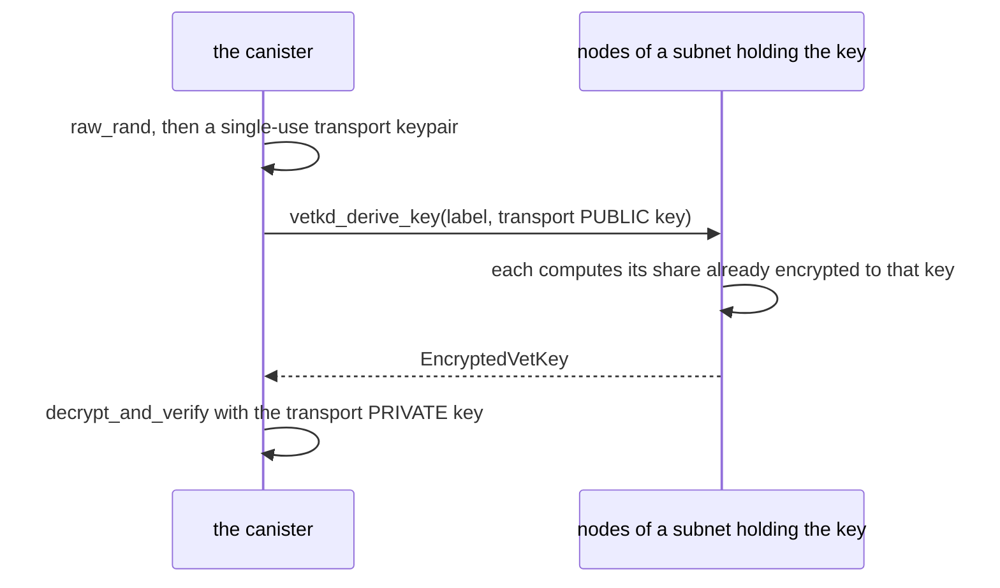

# Design notes

The details behind the [README](../README.md), for anyone reading the code.

## What `vetkd_derive_key` returns

Not a key: an `EncryptedVetKey`.



- **The vetKey is a BLS signature** over the label (`KEY_LABEL`). That is what
  makes the reply verifiable: `decrypt_and_verify` strips the transport
  encryption, then checks the result is a valid signature over the label under
  the canister's public key, so a forged reply is rejected.
- **No node assembles the plaintext vetKey.** Each share is encrypted to the
  transport key before it leaves its node, and only the canister holds the
  transport private key.
- **"Only the canister" means among everyone outside its subnet.** `raw_rand` is
  deterministic given the subnet's random tape, so its own nodes could
  recompute the transport key. That changes nothing: they can read the
  canister's memory anyway, which is why this belongs on a SEV-SNP subnet.

The request is routed to a subnet holding the key, which need not be the
canister's own. What binds the key to your canister is that the derivation takes
the caller's canister id as an input.

## Many secrets, one derivation

Every secret is sealed to the same label, so one derived key opens all of them.
The per-secret names are map keys in the canister; they never reach vetKD.

```text
caller  = your canister id      filled in by the replica; cannot be forged
context = "dummy-secret-poc"    your namespace
label   = "dummy-secrets"       one key, derived once and cached

   ├── secrets["exchange-rate-api-key"]
   └── secrets["rpc-provider-key"]
```

A label per secret would cost a `vetkd_derive_key` each, 26 billion cycles, and
buy nothing: there is no privilege boundary inside a canister, so its code can
derive any label's key anyway. Separate labels pay off when the _readers_ differ,
as in a per-user design.

The derived key is cached. Derivation is deterministic in
`(caller, context, label, key_id)`, none of which depends on the secrets, so
nothing at runtime can invalidate it. Both canisters drop the cache on upgrade,
so editing `CONTEXT` or `KEY_LABEL` cannot leave a cache serving the key for the
old values.

## vetKeys the other way round

Most vetKeys designs keep the canister _outside_ the secret. This one puts it
inside.

| | transport key held by | plaintext ends up in |
|---|---|---|
| `KeyManager`, encrypted maps | the **client** | the user's browser |
| this PoC | the **canister** | canister memory |

In those designs the canister only relays an encrypted key and never sees a
plaintext, so they need no special subnet. Here the canister is the one that
uses the secret, so it unwraps the key itself, and the vetKey and the secrets
sit in replicated memory. Protecting them there is SEV-SNP's job, not vetKD's.
vetKD's job is the transport.

## Choosing the master key

The client derives the public key from a master public key it ships. Mainnet and
a local network both have a key called `key_1`, backed by different master keys,
so a key _name_ does not identify a key. `--source` picks the table; choose the
wrong one and the ciphertext can never be opened, with no error until the
canister tries to decrypt it.

## Who can call

Whoever deploys becomes the controller, and both endpoints accept only the
controller. Nothing here creates or exports an identity. On a machine with none
configured, that principal is _anonymous_. It deploys fine, but the check is then
meaningless, since anyone can call as anonymous.

The controller can always read the secret, by installing code that decrypts it
or by reading a canister snapshot. For seeding that is usually fine: the
controller is whoever sealed the secret and already knows it. To confirm the
right value is deployed without a getter, seal the value you expect and have the
canister compare the plaintexts, answering one bit; the
[`standardization-proposal`](../../../tree/standardization-proposal) branch does
that.
