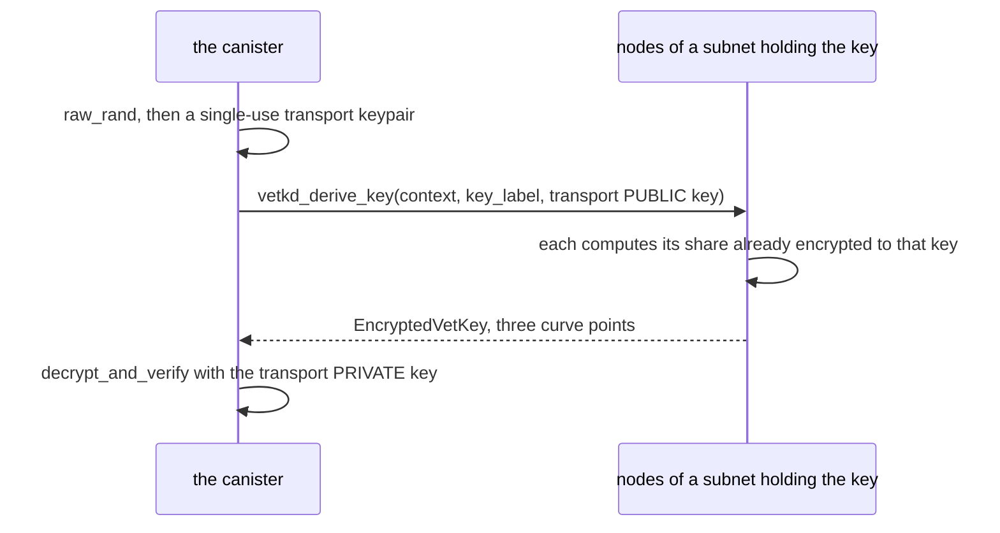

# Design

How the canister decrypts, and the decisions behind the design. The
[README](../README.md) has the overview.

## What `vetkd_derive_key` returns

Not a key: an `EncryptedVetKey`.



The transport secret key never leaves the canister, and it is the whole answer to
"what does the canister know that nobody else does". `decrypt_and_verify` does three
things with it, in order:

1. **consistency**: a pairing check that `c1` and `c2` share one randomiser, so a
   malformed reply is rejected rather than silently unwrapped;
2. **unwrap**: subtract the transport secret key's contribution, and the vetKey falls
   out;
3. **verify**: the vetKey _is_ a BLS signature over the key label, so it is checked
   against the canister's public key before anything is decrypted with it.

That vetKey is also the IBE decryption key for anything sealed to the same label,
which is why one derivation opens every secret in the canister.

**No node ever assembles the plaintext vetKey**; each contributes a share encrypted
to the transport key. But the canister assembles it, and canister memory is
replicated, so once it has, the replicas running that canister hold it. SEV-SNP is
what keeps that memory from the node operators, which is why this belongs on a
SEV-SNP subnet.

## vetKeys the other way round

Most vetKeys designs keep the canister _outside_ the secret. This one puts it inside.

| | transport key held by | plaintext ends up in |
|---|---|---|
| `KeyManager`, encrypted maps | the **client** | the user's browser |
| this PoC | the **canister** | canister memory |

In those designs the canister only relays an encrypted key and never sees a
plaintext, so they need no special subnet. Here the canister is the one that uses the
secret, so it unwraps the key itself, and the vetKey and the secrets sit in
replicated memory. Protecting them there is SEV-SNP's job, not vetKD's. vetKD's job is
the transport.

## Why IBE

Encrypting to a canister needs public-key encryption where the canister holds the
private half. Threshold ECDSA and Schnorr produce _signing_ keys, and the management
canister exposes no decryption operation for them, so they cannot receive a secret.
vetKD can, and IBE is the scheme `ic-vetkeys` already implements on both sides.
"Identity-based" means the public key is derived from a name, the canister id plus a
context, which is why a client can compute it before the canister has ever run.

## Decisions

**The client computes the public key; it never asks for one.** If a client asked the
canister and believed the answer, anyone able to tamper with that reply could
substitute a key they control and harvest the secret, and a reply to a client does
cross boundary nodes. So the client derives the key from a master-key constant it
ships, the canister id and the standard's context. There is no request, so there is
nothing to tamper with.

**The canister takes its own public key from `vetkd_public_key`**, not from a master
key compiled into its Wasm, so one build runs on a local network and on mainnet with
no configuration. Verifying against that is circular, the subnet vouching for itself,
but cheaply so: a subnet that would lie about its public key already holds the master
key and could decrypt everything anyway.

**`set` decrypts before storing.** Otherwise a wrong key name, master key table or
canister id produces a ciphertext that is accepted and found unreadable at a
production call months later. Paying one derivation at seal time turns that into an
error in front of the operator.

**One key label serves every secret.** A single `vetkd_derive_key` unlocks all of
them. A label per secret would multiply the cost and buy nothing: there is no
privilege boundary inside a canister, since its code can derive the key for any
label. It is called `key_label` rather than `identity` because on ICP "identity"
already means a caller's principal; in vetKD terms it is the IBE identity, the
`input` field of `vetkd_derive_key`.

**The canister stores the plaintext, not the ciphertext.** Keeping the ciphertext
would protect nothing: the plaintext reaches memory the moment the secret is used, and
memory is replicated. Sealing protects the secret in transit; SEV-SNP protects it at
rest. A stored ciphertext would only mean losing the secret if the subnet ever stopped
serving the vetKD key.

## Cost

A `vetkd_derive_key` with `key_1` costs **26_153_846_153 cycles** (`test_key_1`:
10_000_000_000), the same locally and on mainnet; `vetkd_public_key` is free. The
figure is `VETKD_FEE`, 10B cycles at the 13-node reference subnet, scaled by
replication factor (`ic/rs/config/src/subnet_config.rs:130`).

It is not paid per secret, since one label serves them all, and not on the path that
spends one, since the plaintext is stored. The vetKey is cached: in Rust on the heap,
so the first `set` or `matches` after an upgrade derives again; in Motoko in persisted
state, so it does not.

## Wire format

```
context   = "icp-sealed-secrets-v1"        // which keypair
key_label = "icp-sealed-secrets-v1.keys"   // which key under it
```

Two constants, and that is the entire format. The version is in the string, and
bumping it is the format break. The canister id already separates one canister from
another, and the suite string separates sealed secrets from any other use of vetKD in
the same canister, so there is nothing left for a client to be told. A sealed
ciphertext is the secret plus a fixed 136 bytes.

| Value | Bytes |
|---|---|
| `context` | `6963702d7365616c65642d736563726574732d7631` |
| `key_label` | `6963702d7365616c65642d736563726574732d76312e6b657973` |

Asserted byte for byte by [`rust/core/tests/golden.rs`](../rust/core/tests/golden.rs),
[`motoko/canister/test/Format.test.mo`](../motoko/canister/test/Format.test.mo) and
[`seed/src/format.test.ts`](../seed/src/format.test.ts), so the three implementations
cannot drift without a suite failing.

Secret names are `[A-Za-z0-9_.-]{1,64}`, matching environment-variable conventions and
avoiding the Unicode confusables an arbitrary Candid `text` would admit. A name is a
map key in the canister; it is not part of any derivation and never reaches vetKD.
