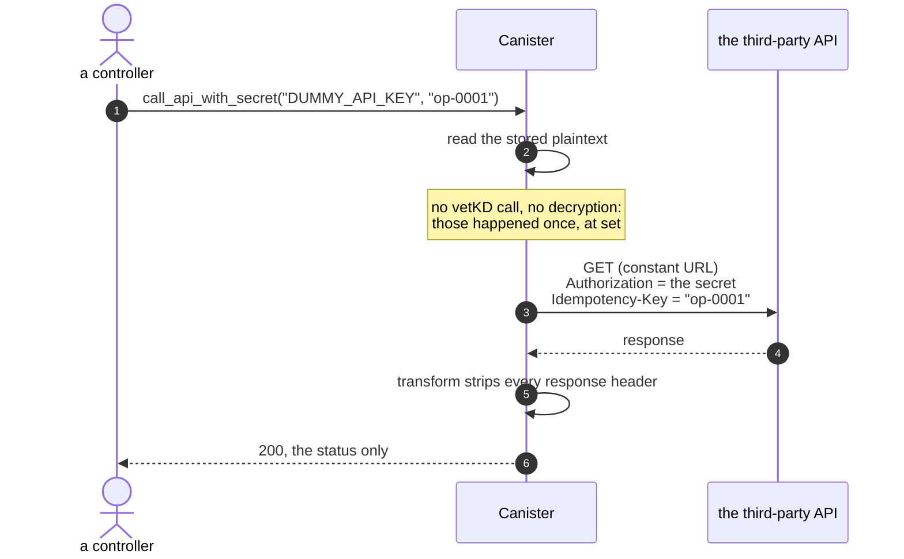

# Using a secret in an HTTPS outcall

Sealing a secret is only useful if the canister can _use_ it. The canonical case is
an authenticated HTTPS outcall, and `call_api_with_secret` in
[`rust/canister/src/lib.rs`](../rust/canister/src/lib.rs) is a worked example. It is
not part of the proposed standard; a real canister writes its own.

`local-test.sh` step 10 asserts both outcomes when the API is reachable, and warns and
skips if it is not: `200` with the sealed credential, and `401` with a wrong one, which
is what shows the secret's _value_ is what authenticated.

## Four rules the example follows

| Rule | Why |
|---|---|
| **The URL is a constant, not a parameter** | `call_api(url, name)` would be an exfiltration primitive: point it at your own server and the secret is yours |
| **Only the status code comes back** | plenty of endpoints echo request headers, so returning the body can hand your own `Authorization` header back to the caller |
| **The transform is mandatory** | in a replicated call every node makes the request and consensus needs byte-identical responses, so `Date`, request ids and cookies must go. Stripping headers also stops an endpoint echoing the secret back in one; the body passes through, so an endpoint that echoes it in the body still would |
| **Mutating calls need an idempotency key** | one logical outcall is N real HTTP requests, one per node. A `POST` that charges a card would happen N times unless the API deduplicates |

The idempotency key is a _parameter_ because only the caller knows whether a call is
a retry of one operation or a new one. It needs no special derivation: the request is
built once during replicated execution, so every node sends the same bytes.

This transform strips headers and passes the **body** through, which is only safe
because the demo endpoint returns a constant. If yours returns a timestamp or a
request id, normalise the body too.

## What a local run hides

The local registry advertises 13 nodes for the application subnet, but PocketIC runs
one outcalls adapter client per subnet, so it issues **one** real request per outcall.
A body that changes every second, such as `postman-echo.com/time/now`, still returns
`200` locally. So both of these pass locally and break on mainnet:

- **a missing idempotency key on a mutating call**: on a 34-node subnet the request,
  and so the charge, the email or the row, happens 34 times;
- **a response body that varies per node**: every call fails consensus.

## Why postman-echo

The demo calls `https://postman-echo.com/basic-auth`, which accepts the documented
`postman:password` and rejects anything else. An endpoint that _ignores_
`Authorization` would answer `200` whatever the canister sent, proving nothing about
the secret. A published credential proves nothing about secrecy, but it proves the
mechanism: seal the right value and see `200`, a wrong one and see `401`, with no real
key anywhere in the repo. Point the constant at your own API for anything real.

The sealed secret is the complete `Authorization` header value, so the same code works
for `Bearer ghp_…`, `Basic dXNlcjpwYXNz` or any other scheme.

## Where the plaintext goes

Using the secret in a header does not widen the trust boundary beyond what decryption
already crossed, but the request context, headers included, enters replicated state on
**every** node before any of them executes the call.

| Where the plaintext is | Protected on a SEV-SNP subnet? |
|---|---|
| `CanisterHttpRequestContext { url, headers, body }` in replicated state, checkpointed | ✅ memory encryption and a measurement-keyed data disk |
| the request built by `ic-https-outcalls-adapter` | ✅ a GuestOS service, inside the SEV guest |
| on the wire to the endpoint | ✅ TLS, terminated by the adapter |
| through a SOCKS proxy on another node | ✅ the proxy sees only TLS ciphertext |

On any other subnet, every node operator can read it.

**A trap:** `flexible_http_request` lets a canister set `replication.total_requests` as
low as 1. That reduces how many nodes open a connection, but not how many hold the
header bytes, since the request context is in replicated state before any node
executes it. It is an egress knob, not a confidentiality control.

Still visible even on SEV-SNP, because it is outside the encrypted payload: the
destination host (TLS SNI, DNS), timing, and request and response sizes.
